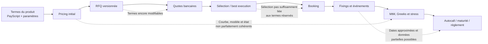

# Audit complet — Pricing, RFQ et cycle de vie

**Projet :** STRUCTURA / INDEX_STUDIO
**Date de l'audit :** 31 juillet 2026
**Révision Git de référence :** `4f7bffc`, complétée par les modifications locales présentes dans le worktree au moment de l'audit
**Périmètre :** structuration PayScript, pricing, modèles, sensibilités, RFQ, sélection, booking, valorisation, événements, risques et dénouement
**Hors périmètre :** AMC
**Nature de la mission :** audit fonctionnel, quantitatif et opérationnel, sans modification du code
**Verdict :** **NO-GO pour une utilisation institutionnelle en production**

---

## 1. Synthèse exécutive

La plateforme possède une base fonctionnelle riche : définition de payoffs, Monte Carlo multi-modèles, Greeks, RFQ, booking, suivi des événements, valorisation résiduelle, stress et P&L explain. La suite automatique exécutée dans le `.venv` du projet retourne **312 tests réussis**.

Ce résultat ne suffit cependant pas à autoriser une mise en production. L'audit a mis en évidence plusieurs défauts pouvant produire :

- un prix incohérent avec la courbe de taux utilisée pour l'actualisation ;
- des sensibilités ou stress sans rapport avec l'état réel d'un deal vivant ;
- une RFQ et un deal réservé portant sur des caractéristiques différentes ;
- une piste de best execution formellement complète mais économiquement fausse ;
- une mauvaise décision d'autocall ou de remboursement à cause d'une date historique mal rejouée ;
- des probabilités de perte en capital et de knock-in matériellement erronées ;
- un prix quanto appliqué à tort ou construit avec un marché de devises incomplet ;
- une modification rétroactive de données contractuelles ou d'événements déjà observés ;
- une agrégation de risques qui ignore le sens économique achat/vente ;
- une valorisation sur données manquantes remplacées silencieusement par des valeurs neutres.

Le problème central n'est pas la sophistication des modèles. Il est l'absence de garanties fortes entre les différentes étapes de la chaîne de production :



### Conclusion de gouvernance

La plateforme peut rester un environnement de recherche, de démonstration ou d'aide à la structuration sous contrôle expert. Elle ne doit pas être utilisée comme moteur officiel de prix, preuve automatique de best execution, registre contractuel ou source de risques de production tant que les blocages P0 ne sont pas corrigés et validés indépendamment.

---

## 2. Périmètre et exclusions

### 2.1 Inclus dans l'audit

- syntaxe, compilation et exécution PayScript ;
- détermination des calendriers et horizons ;
- Monte Carlo GBM, Heston, SABR, Local Vol et LSV ;
- courbe de taux et taux stochastiques ;
- quanto et paramètres multi-devises ;
- corrélations et génération des trajectoires ;
- actualisation et agrégation des cash-flows ;
- Greeks, scénarios et solveur ;
- probabilités, backtest et Mark-to-Future ;
- création et modification d'une RFQ ;
- quotes, last-look, sélection et analyse bancaire ;
- passage RFQ vers booking ;
- génération et rafraîchissement des événements ;
- replay historique, MtM et P&L explain ;
- risques portefeuille et conversion FX ;
- intégrité de la base, concurrence et contrôles d'accès.

### 2.2 Explicitement exclus

- logique métier AMC ;
- calculs de performance AMC ;
- attribution et analytics propres aux AMC ;
- chaîne de production et reporting AMC.

Les utilitaires partagés avec le reste de la plateforme, notamment les prix et conversions FX, restent examinés lorsqu'ils affectent directement les deals structurés hors AMC.

---

## 3. Méthodologie

L'audit a combiné :

1. une lecture statique de la chaîne front-end, API, moteur et base ;
2. une revue des formules et hypothèses de modèles ;
3. des tests adverses ciblés en mémoire ;
4. un contrôle en lecture seule de la base existante ;
5. la relance de la suite automatique ;
6. une seconde passe indépendante centrée sur les invariants transverses.

### 3.1 Convention de sévérité

| Niveau | Définition |
|---|---|
| **P0 — Bloquant** | Peut créer un prix, une exécution, un risque ou un événement contractuel faux. Empêche la production. |
| **P1 — Majeur** | Peut produire une incohérence matérielle, une erreur silencieuse ou une piste d'audit insuffisante. |
| **P2 — Significatif** | Limite méthodologique ou opérationnelle importante, mais contournable avec contrôle manuel. |
| **P3 — Amélioration** | Renforcement de lisibilité, robustesse ou gouvernance. |

### 3.2 Limite de reproductibilité du snapshot

Le worktree contenait de nombreuses modifications locales non commitées. Le hash Git seul ne permet donc pas de reconstruire exactement l'état audité. Pour les prochains audits, un snapshot immuable, un tag ou un commit de validation doit être créé avant le début des travaux.

---

## 4. Tableau de synthèse des blocages

| ID | Priorité | Domaine | Constat |
|---|---:|---|---|
| PRC-01 | P0 | Pricing | Drift déterministe et actualisation peuvent utiliser deux courbes différentes |
| PRC-02 | P0 | Taux | Le modèle présenté comme Hull-White ne garantit pas exactement la courbe initiale |
| RSK-01 | P0 | Risques | Greeks et stress de deals vivants peuvent redémarrer le spot ou l'état du produit |
| RSK-02 | P0 | Portefeuille | Le sens achat/vente n'est pas appliqué aux agrégations de risques |
| RFQ-01 | P0 | RFQ/booking | Le deal réservé n'est pas économiquement réconcilié avec la RFQ |
| RFQ-02 | P0 | Audit trail | Les termes RFQ restent modifiables sans version immuable attachée aux quotes |
| LCY-01 | P0 | Lifecycle | Le replay historique utilise des décalages de lignes plutôt que les dates exactes |
| LCY-02 | P0 | Registre | Deals, événements et spots contractuels restent modifiables ou recalculables |
| ANA-01 | P0 | Analytics | Les métriques KI, autocall et perte en capital ne décrivent pas les événements économiques |
| MKT-01 | P0 | Market data | Yahoo auto-adjusted ne constitue pas une source de fixing contractuel stable |
| CCY-01 | P0 conditionnel | Quanto | L'ajustement FX peut être appliqué dans la même devise et le marché FX est incomplet |
| PRC-03 | P1 | Validation | Maturités et paramètres de modèles insuffisamment contraints |
| PRC-04 | P1 | Solveur | Faux statut de convergence sur payoff discontinu |
| DSL-01 | P1 | PayScript | Indices, baskets et types de PARAM insuffisamment validés |
| RFQ-03 | P1 | Last-look | Une quote superseded peut rester sélectionnée et être bookée |
| RFQ-04 | P1 | Multi-actifs | La RFQ ne transporte pas toujours l'univers de marché complet du pricer |
| LCY-03 | P1 | Données | Un sous-jacent manquant peut être remplacé silencieusement par `1.0` |
| LCY-04 | P1 | P&L explain | Le point de départ n'est pas nécessairement la fair value gelée au booking |
| MTF-01 | P1 | Mark-to-Future | Le moteur MTF ne conserve pas tout l'état du produit et simplifie le modèle extérieur |
| OPS-01 | P1 | Base | Contraintes et protections de concurrence insuffisantes |
| SEC-01 | P1 | Sécurité | Secret JWT par défaut et endpoints quantitatifs coûteux insuffisamment protégés |

---

## 5. Constats détaillés — P0

### 5.1 PRC-01 — Incohérence entre drift et discounting avec une courbe déterministe

#### Constat

La courbe de taux sert à construire les facteurs d'actualisation :

```text
DF(0,t) = exp(-R(t) × t)
```

avec interpolation linéaire des taux zéro. En revanche, lorsque les taux stochastiques sont désactivés, le drift des sous-jacents continue d'utiliser le taux scalaire `r_eff`.

Références :

- `backend/app/core/payscript/engine.py:246-257`
- `backend/app/core/payscript/engine.py:610-641`
- `backend/app/core/payscript/engine.py:1186-1202`

#### Impact

Un actif simulé avec un carry construit sur `r = 3 %` peut être actualisé avec une courbe dont le taux à maturité vaut, par exemple, 1 % ou 5 %. La propriété de martingale sous la mesure risque-neutre n'est alors plus respectée.

Un payoff linéaire ou un zéro-coupon peut faire apparaître un P&L artificiel uniquement parce que le drift et le numéraire ne sont pas cohérents.

#### Recommandation

- dériver les forwards instantanés de la même courbe utilisée pour les discount factors ;
- utiliser ces forwards dans le drift de tous les modèles ;
- rendre impossible la coexistence silencieuse d'un `r` scalaire incohérent et d'une courbe ;
- ajouter des tests de martingale pour chaque modèle et chaque mode de taux.

---

### 5.2 PRC-02 — Ajustement Hull-White incomplet

#### Constat

Le taux est représenté sous la forme :

```text
r(t) = f(0,t) + x(t)
dx(t) = -a × x(t)dt + sigma_r × dW(t)
```

et le discount factor chemin par chemin est :

```text
DF_path(0,t) = exp(-∫ r(s)ds)
```

Le commentaire du moteur indique que cette construction ajuste automatiquement la courbe initiale. Ce n'est pas exact sans correction de convexité ou shift déterministe adapté : en général,

```text
E[exp(-∫ x(s)ds)] ≠ 1
```

Référence : `backend/app/core/payscript/engine.py:644-694`.

#### Impact

- zéro-coupons mal reproduits lorsque `sigma_r > 0` ;
- prix hybrides equity/rates biaisés ;
- rho et corrélations taux-actions incohérentes ;
- calibration non réconciliable à la courbe observée.

#### Recommandation

Implémenter une spécification Hull-White 1 facteur complète, avec shift calibré à la courbe, formules de bond cohérentes et tests :

- reproduction de chaque zéro-coupon ;
- limite `sigma_r → 0` ;
- comparaison analytique/Monte Carlo ;
- stabilité selon le pas de temps.

---

### 5.3 RSK-01 — Greeks et stress non fiables sur un deal vivant

#### Constat

Les calculs de sensibilités et de scénarios peuvent relancer le produit comme s'il partait de l'origine :

- spot normalisé réinitialisé ;
- historique des barrières incomplet ;
- mémoire coupon ou accumulation réinitialisée ;
- état de fixing et précédent spot non systématiquement conservés ;
- maturité résiduelle et index d'observation susceptibles de diverger du deal réel.

#### Impact

Le delta, gamma, vega, rho, stress et P&L projeté peuvent décrire un nouveau produit et non la position réellement détenue.

Ce défaut est particulièrement matériel pour :

- Phoenix mémoire ;
- autocalls proches d'une date d'observation ;
- produits avec barrière continue ;
- produits avec strike averaging ;
- structures utilisant `ACCUM`, `INDEX`, `S_MIN`, `S_MAX`, `REALVOL` ou `PREV`.

#### Recommandation

Créer un objet immuable `ValuationState` contenant au minimum :

- spots courants et spots d'origine ;
- observation index ;
- événements déjà exécutés ;
- cash-flows payés ;
- mémoires et accumulateurs ;
- extrema historiques ;
- états de fixing ;
- courbes et snapshot de marché ;
- date de valorisation et maturité résiduelle.

Tous les calculs live doivent consommer exactement le même état.

---

### 5.4 RSK-02 — Sens achat/vente ignoré dans les risques portefeuille

#### Constat

Les agrégations multiplient les Greeks ou impacts par le nominal et le FX, sans appliquer de signe correspondant au sens du deal.

Références :

- `backend/app/api/portfolios.py:156-238`
- `backend/app/api/shocks.py:122-154`

#### Impact

Une position acheteuse et une position vendeuse économiquement opposées peuvent s'additionner au lieu de se compenser. Les expositions directionnelles, stress et concentrations deviennent inexploitables pour le hedging.

#### Recommandation

Définir une convention unique et testée :

```text
position_sign = +1 ou -1 selon la perspective retenue
risk_eur = position_sign × greek × nominal × FX × scale
```

La perspective — investisseur, distributeur ou émetteur — doit être explicite sur chaque écran et chaque export.

---

### 5.5 RFQ-01 — Absence de réconciliation économique RFQ → deal

#### Constat

Le booking vérifie :

- l'existence et la propriété de la RFQ ;
- l'absence apparente de booking antérieur ;
- l'existence d'une quote sélectionnée.

Il ne vérifie pas que le deal réservé correspond aux termes de la RFQ.

Référence : `backend/app/api/deals.py:295-320`, puis construction libre du deal à partir du payload `backend/app/api/deals.py:347-372`.

Les contrôles manquants incluent :

- script du deal égal au script de la RFQ ;
- mêmes sous-jacents et même matrice de corrélation ;
- mêmes dates, maturité et nominal ;
- mêmes paramètres utilisateurs et constats ;
- sens du deal cohérent avec le sens de la RFQ ;
- contrepartie égale au provider retenu après mapping ;
- prix traité égal à la quote retenue, à une tolérance documentée près ;
- fair value égale au pricing run approuvé.

#### Reproduction

Une RFQ `PAY 1`, achat, BNP Paribas, quote à 98 a été liée avec succès à un deal contenant :

- un payoff call ;
- une autre banque ;
- le même sens achat au lieu de la convention opposée attendue ;
- un autre ticker ;
- un prix traité de 123,45.

Le deal a été accepté et la RFQ est passée à `clos`.

#### Impact

La piste de best execution peut documenter une RFQ correcte à côté d'un trade différent. Il s'agit d'un faux rapprochement économique, potentiellement plus dangereux qu'une provenance absente.

#### Recommandation

Le booking RFQ ne doit pas accepter un payload économique libre. Le serveur doit construire le deal depuis :

1. une version immuable des termes RFQ ;
2. la quote retenue ;
3. un snapshot de pricing approuvé ;
4. les seules données de booking explicitement autorisées.

Tout override doit être identifié, justifié, approuvé et conservé dans un journal append-only.

---

### 5.6 RFQ-02 — Termes RFQ mutables après réception des quotes

#### Constat

`params_json` reste modifiable sans blocage, y compris après réception des quotes :

- `backend/app/api/rfq.py:461-471`

Il n'existe pas de version contractuelle des termes attachée à chaque quote.

#### Impact

Une banque peut avoir coté la version A alors que :

- l'écran affiche ensuite une version B ;
- la quote reste conservée ;
- la sélection ou le booking semble se rapporter à B ;
- la preuve de best execution ne permet plus de savoir exactement ce qui a été coté.

#### Recommandation

Introduire :

- `rfq_terms_version` ;
- un hash canonique des termes ;
- un snapshot complet par envoi ;
- le hash référencé par chaque quote ;
- invalidation ou requalification obligatoire des quotes après modification ;
- interdiction de muter une version déjà envoyée.

---

### 5.7 LCY-01 — Replay historique fondé sur des positions de lignes

#### Constat

Les dates du script sont converties en nombre approximatif de jours ouvrés :

```text
step = round(year_fraction × 252)
historical_index = start_index + step
```

Références :

- `backend/app/core/payscript/engine.py:2026-2042`
- `backend/app/core/payscript/engine.py:2090-2105`
- `backend/app/core/payscript/engine.py:2132-2157`
- `backend/app/core/payscript/engine.py:2176-2190`

#### Impact

La clôture utilisée peut ne pas correspondre à la date contractuelle. Le risque augmente avec :

- jours fériés ;
- calendriers de bourses différents ;
- données manquantes ;
- sous-jacents multi-zones ;
- années bissextiles ;
- dates de fixing décalées ;
- conventions preceding/following différentes.

Le DealEvent peut afficher un spot déterminé sur la bonne date tandis que le moteur de replay prend une autre ligne historique pour décider l'autocall.

#### Recommandation

- conserver les dates contractuelles résolues, et pas seulement des fractions d'année ;
- définir un calendrier et une convention de roll par actif et par événement ;
- rechercher explicitement le fixing autorisé pour chaque date ;
- journaliser date demandée, date utilisée, source, timestamp et qualité ;
- empêcher toute résolution automatique lorsque les données ne sont pas complètes.

---

### 5.8 LCY-02 — Registre des deals et événements insuffisamment immuable

#### Constat

Des caractéristiques ou événements déjà enregistrés peuvent être modifiés. Les refreshs peuvent également recalculer des spots historiques et le spot initial à partir d'une source auto-adjusted susceptible d'être révisée.

#### Impact

- modification rétroactive du contrat ;
- modification du résultat d'une observation déjà traitée ;
- incapacité à reconstruire exactement une valorisation passée ;
- faiblesse juridique et opérationnelle du registre ;
- P&L historique instable.

#### Recommandation

Adopter un modèle append-only :

- termes contractuels immuables ;
- événements versionnés ;
- correction par contre-écriture ou événement compensatoire ;
- audit utilisateur/date/ancienne valeur/nouvelle valeur/motif ;
- cash ledger séparé des calculs analytiques ;
- snapshot de fixing gelé définitivement après validation.

---

### 5.9 ANA-01 — Mauvaise sémantique des probabilités KI, autocall et perte

#### Constat

Le moteur déduit le résultat économique d'heuristiques sur les cash-flows :

- un chemin non autocall est classé `ki` lorsque le total brut des cash-flows est inférieur à `0.999` ;
- la perte en capital compare le payoff actualisé à une référence de capital ;
- tout `STOP` anticipé est assimilé à un autocall.

Références :

- `backend/app/core/payscript/engine.py:1079`
- `backend/app/core/payscript/engine.py:1650-1753`
- `backend/app/api/deals.py:861-909`

#### Reproductions

| Produit | Résultat économique | Résultat moteur |
|---|---|---|
| `AT MATURITY PAY 1` avec `r = 3 %` | 100 % du principal remboursé | `capital_loss_pct = 100 %` |
| Coupon 10 % avant maturité puis principal 95 % | Perte de 5 % sur le principal | `capital_loss_pct = 0 %` |
| `STOP` anticipé sans remboursement | Résiliation/knock-out possible | classé comme `autocall` |

#### Impact

Les indicateurs affichés au structurer, au risk manager ou au client sont matériellement trompeurs. Ils ne doivent pas être utilisés dans une documentation commerciale, une proposition de réinvestissement ou un contrôle de suitability.

#### Recommandation

PayScript doit émettre des événements typés :

- `COUPON`;
- `PRINCIPAL_REDEMPTION`;
- `AUTOCALL_REDEMPTION`;
- `KNOCK_IN`;
- `KNOCK_OUT`;
- `TERMINATION`;
- `CAPITAL_LOSS`;
- `MATURITY_REDEMPTION`.

Les probabilités doivent être calculées sur ces événements explicites, jamais sur le total actualisé des cash-flows.

---

### 5.10 MKT-01 — Yahoo Finance ne peut pas servir de fixing contractuel

#### Constat

Le service utilise notamment :

```python
yf.Ticker(ticker).history(start=..., end=..., auto_adjust=True)
```

Référence : `backend/app/services/market_data.py:110-116`.

Deux propriétés sont critiques :

- la borne `end` est exclusive ;
- `auto_adjust=True` produit des historiques ajustés pouvant être révisés après corporate actions.

#### Impact

- la date demandée peut être absente ;
- un fixing passé peut changer rétrospectivement ;
- le spot initial contractuel peut être réécrit ;
- une barrière ou un autocall peut être déterminé avec un prix non contractuel ;
- absence de statut officiel, de cut-off et de mécanisme de correction.

#### Recommandation

Séparer strictement :

- **données indicatives** : Yahoo ou source équivalente, utilisables pour démonstration ;
- **données officielles** : source approuvée, calendrier, place, devise, type de prix, cut-off et timestamp ;
- **fixings contractuels** : validés puis gelés dans un registre append-only.

---

### 5.11 CCY-01 — Quanto et multi-devises économiquement incomplets

#### Constat

Le drift utilisé est de la forme :

```text
r + ccyh - q - sigma_FX × rho(S,FX) × sigma_S
```

Références :

- `backend/app/core/payscript/engine.py:254-257`
- `backend/app/core/payscript/engine.py:325-333`

Mais le moteur :

- n'utilise pas effectivement la devise du deal pour activer le quanto ;
- ne représente pas complètement les taux domestique et étranger ;
- n'explicite pas le repo ou carry étranger ;
- ne simule pas le FX ;
- ne possède pas de matrice jointe actifs/FX/taux ;
- applique potentiellement l'ajustement lorsque la devise du deal et celle du sous-jacent sont identiques.

#### Reproduction

Pour un actif EUR dans un deal EUR, l'ajout de `sigma_fx = 10 %` et `rho_sfx = 1` a déplacé le prix d'environ **197 bp**, alors que l'ajustement quanto aurait dû être inactif.

#### Recommandation

Désactiver le quanto jusqu'à disponibilité d'un objet de marché comprenant :

- devise de paiement ;
- devise de chaque actif ;
- courbes domestique et étrangère ;
- repo/dividendes ;
- FX spot et volatilité FX ;
- corrélations cohérentes et matrice PSD ;
- convention quanto ou compo explicitement choisie.

---

## 6. Constats détaillés — P1

### 6.1 PRC-03 — Validation insuffisante des entrées de modèles

`PricingRequest.T` n'impose pas `T > 0` et les paramètres sous-jacents sont presque tous des `float` libres :

- `backend/app/core/schemas.py:6-47`

Sont notamment insuffisamment contraints :

- volatilité ;
- `v0`, `kappa`, `theta`, `xi` ;
- corrélations Heston, SABR, taux et FX ;
- `beta`, `nu` ;
- piliers et taux de courbe ;
- nom du modèle.

Exemples de conséquences :

- `T = 0` ou négatif est transformé en au moins un pas hebdomadaire ;
- `xi = 0` expose le calcul Heston à une division par zéro ;
- corrélations hors de `[-1,1]` partiellement masquées par des `max(0, ...)` ;
- nom de modèle inconnu susceptible de retomber silencieusement sur le GBM.

Reproduction : un zéro-coupon avec `T = 0`, `r = 10 %` retourne environ `0.998079` au lieu de 1 ou d'une erreur.

---

### 6.2 PRC-04 — Faux statut de convergence du solveur

Le solveur retourne `converged=True` lorsque :

```text
abs(price residual) < tolerance
OU
half interval width < tolerance
```

Référence : `backend/app/core/payscript/simulation.py:93-100`.

Sur un digital discontinu :

- prix cible : `0.5`;
- prix obtenu : `0.0`;
- résiduel : `-0.5`;
- résultat : `converged=True`.

La largeur de l'intervalle ne constitue pas une convergence économique. Le statut doit exiger un résiduel acceptable et signaler les discontinuités ou l'absence de solution atteignable.

---

### 6.3 DSL-01 — Validation des indices, baskets et types de paramètres

#### Cas observés

- `S[0]` devient l'indice Python `-1` et sélectionne le dernier sous-jacent ;
- `S[3]` avec deux actifs échoue seulement à l'exécution ;
- `BASKET` utilise `zip(spots, weights)` au numérateur mais la somme de tous les poids au dénominateur ;
- des poids excédentaires peuvent donc modifier le dénominateur tout en étant ignorés au numérateur ;
- les paramètres tableaux peuvent produire des erreurs tardives lorsqu'ils sont utilisés dans un `PAY` scalaire ;
- unicité et nombre des sous-jacents ne sont pas suffisamment garantis.

Références :

- `backend/app/core/payscript/parser.py:172`
- `backend/app/core/payscript/parser.py:225-229`

#### Reproductions

- avec deux actifs normalisés à `1.1` et `0.8`, `PAY S[0]` retourne `0.8` ;
- `BASKET(1,1,100)` sur deux actifs est accepté au lieu d'être rejeté.

#### Recommandation

Effectuer une phase de type-checking et de binding après compilation :

- indices commençant strictement à 1 ;
- bornes validées contre le nombre d'actifs ;
- arité des baskets exacte ;
- type scalaire/tableau connu pour chaque expression ;
- limite de taille, profondeur et complexité du script.

---

### 6.4 RFQ-03 — Quote last-look superseded encore réservable

Une quote initiale sélectionnée peut rester `selected_quote_id` après réception de son enfant last-look. Elle est exclue de certaines statistiques mais n'est pas systématiquement invalidée pour le booking.

Reproduction :

- quote initiale sélectionnée à 99 ;
- last-look reçu à 98,5 ;
- quote initiale marquée superseded ;
- booking accepté avec la provenance de la quote à 99.

La sélection doit pointer vers la dernière quote valide ou être annulée automatiquement.

---

### 6.5 RFQ-04 — RFQ multi-actifs et snapshot de marché incomplets

La création RFQ front-end est principalement structurée autour d'un seul sous-jacent et d'une matrice `[[1]]`. Les scripts experts utilisant `S[2]` ou davantage ne sont pas reliés à une inférence robuste du nombre d'actifs requis.

La transition pricing → RFQ transporte également un snapshot plus léger que celui du pricer. Des paramètres avancés peuvent être omis puis remplacés par des valeurs par défaut :

- courbe ;
- paramètres de taux ;
- calibration Heston/SABR/Local Vol ;
- quanto ;
- conventions de monitoring.

Références :

- `frontend/src/views/RfqView.vue`
- `frontend/src/stores/rfq.js`
- `frontend/src/stores/pricing.js`

Une RFQ exécutable doit reprendre un pricing run immuable complet, et non reconstruire partiellement ses entrées.

---

### 6.6 RFQ-05 — États de quotes et sélection pas assez stricts

Les points suivants doivent être verrouillés côté serveur :

- impossibilité de sélectionner une quote sans prix valide ;
- impossibilité de sélectionner une quote déclinée ou expirée ;
- cohérence entre `quoted_at`, prix et statut ;
- impossibilité de booker une RFQ `sans_suite` ;
- validation de la quote comme dernière réponse valide du provider ;
- validation des nombres finis, y compris rejet de `NaN` et `Infinity`.

La logique de statut déduite est utile, mais ne remplace pas une machine d'états formelle avec transitions autorisées.

---

### 6.7 LCY-03 — Données partielles remplacées par une performance neutre

Lors du replay, un ticker absent ou une observation indisponible peut être remplacé par `1.0` :

- `backend/app/core/payscript/engine.py:2147-2152`
- `backend/app/core/payscript/engine.py:2186-2191`

Dans une basket, cela revient à fabriquer un sous-jacent à 100 % de son niveau initial.

Le lifecycle doit être bloqué en état `data_incomplete` tant que toutes les composantes nécessaires ne sont pas disponibles et validées.

---

### 6.8 LCY-04 — Baseline du P&L explain non gelée au booking

Le P&L explain recalcule une valeur initiale via le moteur historique au lieu d'utiliser systématiquement :

- la fair value officielle gelée ;
- le snapshot de marché du booking ;
- le spot contractuel ;
- les conventions exactes du pricing initial.

La récupération historique avec une borne `end` exclusive peut prendre la clôture précédente au value date.

Conséquence : le P&L « since inception » peut contenir un résiduel dès l'origine et ne pas se réconcilier au prix officiellement réservé.

Référence : `backend/app/api/deals.py`, section `_explain_core`, autour de la ligne 1980.

---

### 6.9 LCY-05 — Calendrier de booking et maturité de secours

Le serveur tente de dériver les observations depuis le script, puis utilise les `observation_times` du client comme fallback.

Cette logique évite certains deals sans calendrier, mais elle permet encore que :

- le client et le serveur utilisent deux ancres différentes ;
- `T`, maturity date et dernière constatation divergent ;
- un calendrier approximé soit réservé alors que le script n'est pas correctement résolu ;
- une date passée soit rabattue sur le premier pas de simulation.

Le booking doit échouer si le calendrier contractuel n'est pas entièrement résolu, réconcilié aux dates du deal et signé dans le snapshot.

---

### 6.10 MTF-01 — Mark-to-Future non équivalent au pricer officiel

Le générateur extérieur MTF utilise toujours un GBM :

- `backend/app/core/payscript/engine.py:1802-1818`

Le moteur :

- ne supporte pas LSV ;
- refuse le monitoring continu ;
- ne transporte pas complètement toutes les mémoires PayScript ;
- peut redémarrer des états de coupon, accumulation, fixing ou observation ;
- ne transporte pas la courbe et les taux stochastiques de manière équivalente au pricing principal.

Référence : `backend/app/core/payscript/engine.py:1841-1879`.

Le MTF peut être conservé comme analyse illustrative, clairement étiquetée, mais pas comme distribution officielle de MtM avant réconciliation chemin par chemin.

---

### 6.11 DATA-01 — Conversion FX manquante remplacée par 1

Lorsque la série FX est vide, plusieurs calculs utilisent `1.0` :

- `backend/app/api/portfolios.py:163`
- `backend/app/api/portfolios.py:290`
- `backend/app/api/portfolios.py:433`
- logique équivalente dans les shocks.

Une exposition USD dans un portefeuille EUR peut alors être agrégée à parité sans alerte.

La bonne règle est :

- même devise : FX = 1 explicite ;
- devise différente, FX absent : calcul bloqué ;
- résultat retourné avec un statut de qualité de données.

---

### 6.12 OPS-01 — Intégrité SQLite et concurrence

#### Constats

- clés étrangères SQLite non activées dans la connexion observée ;
- absence de contrainte unique structurelle sur `deals.rfq_id` ;
- contrôles « select puis insert » exposés aux courses ;
- génération de référence par lecture du suffixe maximal ;
- absence visible de stratégie générale WAL, busy timeout et retry ;
- races possibles sur provider, portefeuille par défaut et alertes.

#### Impact

- une RFQ peut être bookée deux fois par requêtes concurrentes ;
- deux références identiques peuvent être générées ;
- une contrainte applicative peut être vraie lors du `SELECT` et fausse lors de l'`INSERT` ;
- erreurs 500 difficiles à diagnostiquer ;
- enregistrements orphelins possibles.

#### Recommandation

Déplacer les invariants dans la base :

- foreign keys actives ;
- index uniques ;
- transactions atomiques ;
- gestion explicite des `IntegrityError` ;
- stratégie de concurrence adaptée à la production ;
- migration versionnée plutôt que corrections ad hoc au démarrage.

---

### 6.13 SEC-01 — Contrôles d'accès et ressources insuffisants

Le secret JWT possède une valeur par défaut codée en dur :

- `backend/app/api/auth.py:14`

Les endpoints de pricing, solve, grid, scénarios, backtest et MTF sont coûteux et ne disposent pas tous d'une protection proportionnée :

- authentification obligatoire ;
- quota ;
- limite de concurrence ;
- timeout ;
- limite de taille et complexité PayScript ;
- limite mémoire par job ;
- journal d'usage.

Je n'ai pas identifié de possibilité directe d'exécution de code arbitraire dans PayScript avec les éléments examinés. En revanche, l'exécution dynamique et l'absence de limites fortes créent un risque de déni de service.

---

### 6.14 MDL-01 — Fair value propre différente d'un prix exécutable

Le prix actuel est principalement une valeur risque-neutre des cash-flows. Il n'intègre pas explicitement :

- crédit émetteur ;
- probabilité de survie et recovery ;
- funding ;
- collateral et hiérarchie de discounting ;
- coût de hedge ;
- borrow/repo observé ;
- dividendes discrets ;
- liquidité ;
- bid/offer ;
- frais de débouclement ;
- marge de distribution.

Le `model_price` ne doit donc pas être présenté comme benchmark automatique de best execution.

Une passerelle de valorisation doit distinguer :

```text
Clean model PV
+ funding / credit / collateral adjustments
+ hedging and liquidity adjustments
+ distribution economics
= executable indication
```

Chaque ajustement doit être séparé, sourcé, daté et explicable.

---

## 7. Constats P2 et points de gouvernance

### 7.1 Convention de courbe incomplète

La courbe est traitée comme une liste de taux zéro continûment composés. Les éléments suivants ne sont pas explicitement stockés :

- day-count ;
- fréquence de capitalisation ;
- business-day convention ;
- date de courbe ;
- source ;
- devise ;
- type de courbe ;
- extrapolation ;
- interpolation sur taux ou discount factors.

### 7.2 Cash-flows trop abstraits

Les flux PayScript sont essentiellement un montant et un temps. Il manque une représentation contractuelle complète :

- devise du flux ;
- fixing date ;
- payment date ;
- settlement lag ;
- status estimé/confirmé/payé ;
- withholding ou frais ;
- identifiant de paiement.

### 7.3 Sémantique de `N` antithétique ambiguë

Le moteur considère `N` comme le nombre de paires, simule `2N` trajectoires, puis retourne `n_paths = N`.

Référence : `backend/app/core/payscript/engine.py:1173-1178` et `1378`.

Ce n'est pas nécessairement faux quantitativement, mais :

- la consommation mémoire est sous-estimée par l'utilisateur ;
- le nombre de trajectoires affiché est ambigu ;
- la comparaison des performances entre modes est difficile.

### 7.4 Matrice de corrélation réparée silencieusement

Lorsque la matrice possède une petite valeur propre négative, elle est modifiée puis renormalisée.

Référence : `backend/app/core/payscript/engine.py:27-44`.

La réparation doit être :

- visible ;
- mesurée ;
- refusée au-delà d'une tolérance ;
- conservée dans le résultat ;
- appliquée à la matrice complète lorsque taux et FX seront intégrés.

### 7.5 Validation quantitative des modèles avancés

Les modèles Heston, SABR, Local Vol et LSV doivent disposer d'un pack indépendant comprenant :

- limites vers Black-Scholes ;
- martingale ;
- stabilité au pas ;
- stabilité au nombre de paths ;
- comparaison avec références analytiques ;
- positivité et bornes ;
- calibration synthétique ;
- stress extrêmes ;
- surface sans arbitrage ;
- reproductibilité du seed.

### 7.6 Calibration et données de marché

La plateforme accepte des paramètres de modèles mais ne démontre pas une chaîne institutionnelle complète :

- instruments de calibration ;
- sélection des points ;
- pondérations ;
- erreurs de calibration ;
- contraintes ;
- timestamp ;
- source ;
- paramètres acceptés/rejetés ;
- contrôle maker-checker.

Sans cette chaîne, un modèle sophistiqué peut donner un prix précis numériquement mais non représentatif du marché.

---

## 8. Résultats des tests adverses

| Test | Résultat observé | Conclusion |
|---|---|---|
| RFQ et deal économiquement différents | Booking accepté, RFQ clôturée | Réconciliation absente |
| Quote initiale sélectionnée puis last-look | Ancienne quote encore réservable | Sélection invalide |
| Principal 100 % avec actualisation positive | Perte en capital annoncée à 100 % | Mauvaise définition de la perte |
| Principal 95 % + coupon antérieur 10 % | Perte annoncée à 0 % | Coupons masquent la perte de principal |
| Même devise avec paramètres quanto | Déplacement d'environ 197 bp | Quanto appliqué à tort |
| `T = 0`, zéro-coupon, `r = 10 %` | Prix proche de `0.998079` | Horizon silencieusement forcé à une semaine |
| `S[0]` avec deux actifs | Dernier actif sélectionné | Indexation négative |
| Basket avec poids excédentaires | Expression acceptée | Arity et dénominateur incohérents |
| Solve digital, cible 0,5 | `converged=True`, prix obtenu 0 | Fausse convergence |

Ces tests doivent devenir des tests de non-régression explicites.

---

## 9. État de la suite automatique

Commande exécutée dans l'environnement prévu par le projet :

```powershell
.\.venv\Scripts\python.exe -m pytest backend/tests -q
```

Résultat fonctionnel affiché :

```text
312 passed in 118.81s
```

Le wrapper de commande a atteint sa limite de 120 secondes pendant la terminaison, après l'affichage du résultat complet.

### Interprétation

La suite protège plusieurs régressions techniques, mais elle ne couvre pas suffisamment :

- martingale avec courbe non plate ;
- fit Hull-White de la courbe ;
- Greeks live avec historique et mémoire ;
- sens de position ;
- égalité RFQ/deal ;
- versionnement des termes ;
- quote superseded sélectionnée ;
- sémantique du principal et des événements ;
- dates exactes multi-calendriers ;
- données partielles ;
- FX manquant ;
- quanto même devise ;
- solveur discontinu ;
- concurrence de booking.

Des tests verts ne compensent donc pas les P0 reproduits.

---

## 10. Observations sur la base existante

Les contrôles en lecture seule ont identifié :

- `PRAGMA foreign_keys` désactivé sur la connexion examinée ;
- une RFQ reliée à deux deals ;
- trois événements postérieurs à la maturité de leur deal ;
- quatre deals actifs avec spots de strike/S0 vides ;
- quatre deals clôturés dont la provenance ne contient pas les paramètres RFQ complets.

Points rassurants :

- aucun événement partiellement alimenté n'a été détecté dans l'échantillon courant ;
- aucune valeur de prix non finie n'a été détectée ;
- les quatre deals actuellement rapprochés et contrôlés ne présentaient pas de divergence de script, sens, sous-jacent, maturité ou prix par rapport à leur RFQ.

Cette dernière observation montre que la vulnérabilité RFQ → deal n'est pas visible dans les quatre dossiers contrôlés. Elle reste cependant directement exploitable au niveau applicatif.

---

## 11. Ce qui fonctionne ou constitue une bonne base

Les éléments suivants sont utiles et doivent être conservés :

- seed explicite pour la reproductibilité Monte Carlo ;
- utilisation de common random numbers dans plusieurs sensibilités ;
- support de plusieurs modèles ;
- séparation relative entre parsing, simulation et APIs ;
- génération d'une provenance RFQ au booking ;
- blocage applicatif de certains doublons ;
- gestion de scénarios, Greeks et analytics dans un workflow unique ;
- prise en compte d'états avancés PayScript dans le moteur principal ;
- tests quantitatifs et fonctionnels déjà nombreux ;
- distinction affichée entre Mark-to-Future risque-neutre et prévision économique ;
- refus explicite de certains modes MTF non supportés.

Ces points montrent que le projet peut être durci sans repartir de zéro. La priorité doit être donnée aux invariants métier et à l'auditabilité avant l'ajout de nouveaux modèles.

---

## 12. Architecture cible recommandée

### 12.1 Objet `ProductTerms`

Doit contenir de manière immuable :

- PayScript canonique ;
- paramètres et types ;
- sous-jacents ;
- devises ;
- calendriers ;
- dates de fixing et paiement ;
- nominal ;
- conventions de barrières ;
- conventions de remboursement ;
- hash et version.

### 12.2 Objet `MarketSnapshot`

- spots et FX ;
- courbes ;
- dividendes/repo ;
- volatilités/surfaces ;
- corrélations ;
- paramètres calibrés ;
- source et timestamp ;
- conventions ;
- contrôles qualité ;
- hash.

### 12.3 Objet `PricingRun`

- version des termes ;
- snapshot de marché ;
- modèle et version du moteur ;
- seed, paths et tolérances ;
- prix, erreur Monte Carlo et diagnostics ;
- Greeks ;
- utilisateur et timestamp ;
- statut brouillon/approuvé.

### 12.4 Objet `RFQTermsVersion`

- lien vers `ProductTerms` et `PricingRun` ;
- version immuable ;
- hash envoyé au provider ;
- quote rattachée au même hash ;
- journal des amendements.

### 12.5 Objet `Deal`

Construit côté serveur depuis la version RFQ et la quote retenue. Toute différence doit être un amendement explicite.

### 12.6 Objet `LifecycleState`

- fixings validés ;
- événements économiques typés ;
- cash ledger ;
- mémoires du payoff ;
- barrières et extrema ;
- date de valorisation ;
- qualité des données ;
- état résolu/non résolu.

---

## 13. Plan de remédiation proposé

### Phase 0 — Mesures conservatoires immédiates

À appliquer avant toute utilisation élargie :

1. afficher clairement « données indicatives — non contractuelles » ;
2. désactiver le booking RFQ à partir d'un payload économique libre ;
3. désactiver les métriques KI/perte en capital dans les documents ;
4. désactiver le quanto et le multi-devises non couvert ;
5. empêcher le calcul de risques live si l'état du deal est incomplet ;
6. bloquer toute conversion FX manquante ;
7. retirer la clé JWT par défaut ;
8. limiter et authentifier les endpoints de calcul.

### Phase 1 — Intégrité de la chaîne de production

1. versionnement immuable des termes ;
2. pricing run approuvé et hashé ;
3. RFQ attachée à ce run ;
4. quote attachée à la version exacte ;
5. booking construit côté serveur ;
6. contrainte unique sur `deals.rfq_id` ;
7. foreign keys et transactions atomiques ;
8. registre append-only des modifications.

### Phase 2 — Correction quantitative

1. drift cohérent avec la courbe ;
2. Hull-White calibré exactement ;
3. validation stricte des paramètres ;
4. solveur avec convergence économique ;
5. résultats PayScript typés ;
6. Greeks et shocks consommant le `LifecycleState` ;
7. signe de position partout ;
8. pack de validation indépendant par modèle.

### Phase 3 — Lifecycle institutionnel

1. calendriers contractuels exacts ;
2. source officielle de fixings ;
3. statuts de qualité de données ;
4. double validation des événements matériels ;
5. cash ledger ;
6. P&L explain réconcilié à la fair value du booking ;
7. événements et corrections append-only ;
8. rapprochement quotidien et rapports d'exception.

### Phase 4 — Prix exécutable et gouvernance

1. clean price ;
2. ajustements crédit/funding/collateral ;
3. coûts de hedge et liquidité ;
4. marge de distribution ;
5. tolérances de best execution ;
6. maker-checker ;
7. documentation de modèle ;
8. validation indépendante et sign-off.

---

## 14. Critères minimaux de GO production

Le GO ne devrait être accordé que lorsque tous les critères suivants sont satisfaits.

### Pricing

- martingale validée avec courbe plate et non plate ;
- zéro-coupons reproduits par le modèle de taux ;
- paramètres strictement validés ;
- chaque modèle possède un benchmark indépendant ;
- Greeks stables et réconciliés ;
- erreur Monte Carlo et convergence exposées ;
- conventions de courbe complètes.

### RFQ

- termes immuables et versionnés ;
- quote liée à un hash de termes ;
- quote sélectionnée valide et non superseded ;
- deal généré depuis la RFQ ;
- prix et contrepartie réconciliés ;
- exceptions approuvées et journalisées ;
- une RFQ ne peut produire qu'un deal.

### Lifecycle

- dates exactes et calendriers explicites ;
- fixings officiels et gelés ;
- aucune donnée manquante remplacée silencieusement ;
- événements typés ;
- cash-flows enregistrés ;
- état du payoff transporté vers MtM, Greeks et stress ;
- dénouement automatique testé sur cas limites.

### Opérations et sécurité

- clés étrangères actives ;
- contraintes uniques en base ;
- transactions et concurrence testées ;
- secrets externalisés ;
- endpoints protégés et limités ;
- journal d'audit complet ;
- sauvegarde, restauration et reprise testées.

### Gouvernance

- documentation des modèles ;
- inventaire des limitations ;
- procédure de changement ;
- validation indépendante ;
- sign-off Pricing, Risk, Trading et Operations ;
- preuves de non-régression archivées.

---

## 15. Pack de tests de non-régression obligatoire

### 15.1 Tests analytiques

- zéro-coupon ;
- forward ;
- call/put Black-Scholes ;
- digital ;
- limites Heston vers Black-Scholes ;
- limites SABR ;
- martingale par modèle ;
- courbe plate/non plate ;
- taux stochastiques avec reproduction des bonds.

### 15.2 Tests produit

- autocall sans mémoire ;
- Phoenix mémoire ;
- reverse convertible ;
- worst-of multi-actifs ;
- barrière discrète et continue ;
- strike averaging ;
- coupons conditionnels ;
- paiement anticipé non autocall ;
- capital protégé et partiellement protégé.

### 15.3 Tests RFQ

- amendement après quote ;
- quote déclinée/expirée ;
- last-look favorable et défavorable ;
- quote superseded sélectionnée ;
- booking avec autre script ;
- booking avec autre ticker ;
- booking avec autre maturité ;
- booking avec autre prix ;
- booking concurrent ;
- RFQ sans suite ;
- provider sans mapping contrepartie.

### 15.4 Tests lifecycle

- jours fériés ;
- actifs avec calendriers différents ;
- date sans clôture ;
- corporate action ;
- ticker manquant ;
- événement après maturité ;
- fixing corrigé ;
- produit déjà autocallé ;
- produit avec coupons payés ;
- valorisation à la date de booking ;
- réconciliation P&L jour 0.

### 15.5 Tests opérationnels

- appels concurrents ;
- reprise après crash ;
- timeout pricing ;
- script de complexité maximale ;
- rollback transactionnel ;
- restauration de base ;
- permissions inter-entités ;
- audit des modifications.

---

## 16. Conclusion générale

STRUCTURA dispose d'un socle prometteur pour la recherche, la structuration et la démonstration de produits structurés. Le moteur contient déjà davantage de fonctionnalités que beaucoup de prototypes : PayScript, multi-modèles, courbes, Greeks, RFQ, booking, lifecycle et analytics.

Le principal risque vient toutefois de la discontinuité entre ces fonctions. Un prix peut être calculé avec un état, une RFQ envoyée avec un snapshot partiel, un deal booké avec d'autres caractéristiques, puis un lifecycle rejoué avec des dates approximatives et des données révisables. Chaque brique peut sembler fonctionner isolément alors que la chaîne complète n'est pas économiquement déterministe.

La priorité n'est donc pas d'ajouter un modèle supplémentaire. Elle est de rendre la chaîne :

- immuable sur ses termes matériels ;
- déterministe ;
- réconciliable ;
- versionnée ;
- explicable ;
- bloquante en cas de donnée manquante ;
- testée sur des invariants économiques et non seulement techniques.

**Décision recommandée : NO-GO production jusqu'à clôture des P0 et validation indépendante de la chaîne complète.**

---

## Annexe A — Principales références de code

| Domaine | Fichier |
|---|---|
| Schémas pricing | `backend/app/core/schemas.py` |
| Parser PayScript | `backend/app/core/payscript/parser.py` |
| Monte Carlo et lifecycle replay | `backend/app/core/payscript/engine.py` |
| Solveur et grilles | `backend/app/core/payscript/simulation.py` |
| API pricing | `backend/app/api/pricing.py` |
| API RFQ | `backend/app/api/rfq.py` |
| Booking et lifecycle | `backend/app/api/deals.py` |
| Agrégation portefeuille | `backend/app/api/portfolios.py` |
| Stress | `backend/app/api/shocks.py` |
| Modèles de base | `backend/app/db/models.py` |
| Initialisation base | `backend/app/db/database.py` |
| Données de marché | `backend/app/services/market_data.py` |
| Store pricing | `frontend/src/stores/pricing.js` |
| Store RFQ | `frontend/src/stores/rfq.js` |
| Vue RFQ | `frontend/src/views/RfqView.vue` |

## Annexe B — Documents de contexte consultés

- `AUDIT_PRICING_2026-07.md`
- `AUDIT_RFQ_2026-07-29.md`
- `AUDIT_CHAINE_RFQ_2026-07-30.md`
- `DEAL_LIFECYCLE_2026-07.md`

Ces documents fournissent un historique utile des corrections. Le présent rapport constitue néanmoins une photographie transversale indépendante et prévaut pour le verdict de production au 31 juillet 2026.
