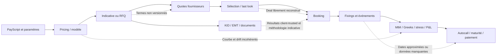

# Audit de production complet — STRUCTURA / INDEX_STUDIO

**Date :** 31 juillet 2026
**Révision Git de base :** `4f7bffc`
**Snapshot réellement audité :** révision ci-dessus + worktree local courant non commité
**Périmètre :** architecture, backend, frontend, pricing, modèles, PayScript, RFQ, booking, lifecycle, risques, KID/EMT, documents, FIFO, sécurité, performance, exploitation, tests et UX/UI
**Hors périmètre explicite :** logique métier, calculs, analytics et reporting AMC
**Nature de la mission :** audit en lecture seule ; aucune correction de code ou de donnée
**Décision recommandée :** **NO-GO production**

---

## 1. Synthèse exécutive

STRUCTURA est un prototype fonctionnel riche, bien plus avancé qu'une simple démonstration : PayScript, pricing Monte Carlo, modèles avancés, sensibilités, RFQ, booking, suivi d'événements, MtM résiduel, stress, P&L explain, KID/EMT, documents et files de calcul sont présents dans un workflow cohérent au niveau de l'interface.

La plateforme n'est cependant pas prête pour une utilisation institutionnelle en production. Le principal problème n'est pas un manque de fonctionnalités. Il est l'absence de garanties fortes sur les invariants qui relient ces fonctionnalités :

- le prix peut être calculé avec un drift incohérent avec la courbe d'actualisation ;
- le modèle de taux présenté comme Hull-White ne garantit pas le fit exact annoncé ;
- les probabilités de perte, KI et autocall reposent sur des heuristiques de cash-flows pouvant inverser le sens économique ;
- la RFQ et le deal booké peuvent porter sur des termes différents ;
- les termes RFQ ne sont ni versionnés ni hashés par quote ;
- des risques live peuvent ignorer l'état réellement consommé du payoff ;
- le sens achat/vente n'est pas appliqué de façon homogène aux risques, stress, P&L et marges ;
- le replay historique raisonne par décalage de lignes et la donnée historique peut contenir un look-ahead initial par `bfill()` ;
- des données manquantes sont remplacées silencieusement par `1.0` ;
- des comptes administrateur de démonstration connus sont créés au démarrage et exposés dans l'interface ;
- les endpoints quantitatifs les plus coûteux sont publics et sans quota ;
- les registres dits immuables KID/EMT acceptent des résultats calculés et envoyés par le client ;
- la méthode KID est une approximation qui ne constitue pas une implémentation conforme de la méthodologie PRIIPs ;
- SQLite est utilisé sans clés étrangères actives, migration versionnée, stratégie de verrouillage ou contrainte unique sur une RFQ bookée ;
- l'ordonnanceur lifecycle et la file de calcul ne sont pas sûrs face aux redémarrages, doublons ou exécutions concurrentes ;
- aucune CI, couverture mesurée, suite frontend ou recette E2E n'existe.

La suite backend reste une bonne base : **312 tests réussis en 118,81 secondes** lors de la passe précédente dans le `.venv` du projet. Ce résultat protège des régressions techniques importantes, mais il ne couvre ni les principaux invariants économiques ni la sécurité, le frontend, la concurrence et les opérations de production.

### Verdict

La plateforme peut être utilisée comme environnement de recherche, de démonstration ou d'aide au structuring sous contrôle expert. Elle ne doit pas devenir :

- le moteur officiel de prix ;
- la source de preuve automatique de best execution ;
- le registre contractuel de fixings et d'événements ;
- la source officielle de risques portefeuille ;
- un générateur réglementaire KID/EMT ;
- un service on-premise client ;

tant que les P0 de ce rapport ne sont pas clôturés et validés indépendamment.

---

## 2. Compréhension du système et de la chaîne de production

### 2.1 Architecture observée

- **Backend :** FastAPI, SQLModel/SQLAlchemy, SQLite, NumPy/SciPy/Pandas.
- **Frontend :** Vue 3, Pinia, Vue Router, Vite, Tailwind, Chart.js.
- **Déploiement actuel :** processus Uvicorn local sur `127.0.0.1:8000`, frontend précompilé servi par FastAPI.
- **Calculs lourds :** exécution synchrone dans les endpoints ou file SQLite avec worker séparé.
- **Données de marché :** principalement Yahoo Finance/yfinance et caches locaux.
- **Authentification :** JWT Bearer stocké dans `localStorage`.
- **Lifecycle :** refresh à la demande et boucle quotidienne créée dans le processus web.
- **Persistance métier :** tables SQL avec de nombreux champs JSON sérialisés en texte.

### 2.2 Chaîne métier comprise



### 2.3 Ce qui est réellement protégé

- Les deals, RFQ, scripts, portefeuilles et documents sont généralement filtrés par `user_id`.
- Les scripts partagés sont filtrés par entité après chargement.
- Plusieurs snapshots sont conservés sur les deals.
- Les références ont maintenant des index uniques.
- Les RFQ bookées sont partiellement gelées contre certaines modifications.
- Les calculs Monte Carlo utilisent des seeds explicites et souvent des common random numbers.

### 2.4 Ce qui n'est pas garanti

- égalité économique entre pricing, RFQ, quote et deal ;
- immutabilité des termes ayant donné lieu à une quote ;
- source officielle et gel des fixings ;
- exactitude du state transfer vers tous les calculs live ;
- atomicité des claims de calcul et du booking RFQ ;
- version du moteur, du modèle, des termes et du marché ayant produit un résultat ;
- séparation des environnements développement, recette et production ;
- contrôle des ressources par utilisateur ;
- reproductibilité d'une release déployable.

---

## 3. Méthodologie, preuves et limites

### 3.1 Travaux effectués

1. Cartographie des modules backend et frontend hors AMC.
2. Lecture statique des routes, schémas, modèles SQL, moteurs, stores et vues.
3. Revue des formules et conventions du pricing.
4. Revue de la chaîne pricing → RFQ → booking → lifecycle → risques.
5. Contrôles adverses déjà exécutés sur les cas économiques critiques.
6. Contrôle en lecture seule de la base SQLite courante.
7. Inventaire des tests et des domaines non couverts.
8. Contrôle des dépendances installées avec OSV et `npm audit`.
9. Revue UX/UI statique selon les principes d'interface institutionnelle du projet.
10. Second passage transversal centré sur les failles de sécurité, concurrence, persistance, KID/EMT, fichiers et exploitation.

### 3.2 Limites

- L'application n'était pas disponible sur `localhost:8000` pendant l'audit.
- Le serveur n'a pas été démarré, car son startup appelle `init_db()` et modifie potentiellement la base.
- L'audit UI est donc **statique**, sans recette visuelle navigateur, mobile, clavier ou lecteur d'écran.
- Aucun test de charge, pentest réseau, test de restauration, failover ou interruption réelle de processus n'a été exécuté.
- Le worktree contenait **110 entrées modifiées, supprimées ou non suivies** ; le hash Git seul ne reconstruit pas l'état audité.
- L'audit réglementaire KID/EMT vérifie les divergences techniques manifestes avec la méthodologie officielle ; il ne remplace pas un avis juridique ou une validation réglementaire formelle.

### 3.3 Conventions

| Niveau | Définition |
|---|---|
| **P0 — bloquant** | Peut produire une perte, un prix, une preuve, un événement, un document réglementaire ou une compromission matériellement faux. |
| **P1 — majeur** | Peut provoquer une erreur silencieuse, une indisponibilité, une fuite, une corruption ou une piste d'audit insuffisante. |
| **P2 — significatif** | Dette ou limite importante, contournable temporairement avec contrôle manuel. |
| **P3 — amélioration** | Renforcement de qualité, lisibilité, confort ou industrialisation. |

La **probabilité** indique la facilité d'occurrence dans l'usage prévu, pas seulement la probabilité d'un attaquant externe.

---

## 4. Scores

| Domaine | Score /10 | Appréciation |
|---|---:|---|
| Architecture | **4,0** | Architecture lisible à petite échelle, mais monolithe fortement couplé et sans frontières métier strictes. |
| Qualité de code | **5,0** | Commentaires et intentions souvent solides ; modules et fonctions trop volumineux, contrats JSON fragiles. |
| Correction fonctionnelle | **3,0** | Nombreux workflows présents, mais invariants critiques non garantis. |
| Pricing et modèles | **3,0** | Socle quantitatif riche ; plusieurs incohérences de mesure, courbe, state et analytics. |
| RFQ / best execution | **3,0** | Workflow avancé ; absence de réconciliation et de version exacte des termes. |
| Lifecycle / registre | **2,5** | Fonctionnel, mais données non officielles, dates approximées et mutabilité rétroactive. |
| KID / EMT | **2,0** | Aide de desk utile ; ne doit pas être présenté comme moteur réglementaire. |
| Sécurité | **2,0** | Secrets et comptes connus, CORS ouvert, endpoints publics, SSRF et stockage de clés. |
| Performance / scalabilité | **3,0** | Quelques limites locales ; aucune gouvernance globale des ressources. |
| Fiabilité / exploitation | **2,0** | Pas de service, backup, migration versionnée, monitoring ou scheduler durable. |
| UX/UI | **6,0** | Interface institutionnelle et riche, mais dense, très petite et peu responsive. |
| Accessibilité | **4,5** | Focus et modale partiellement traités ; contrôles natifs et labels incomplets. |
| Tests / QA | **4,5** | 312 tests backend utiles ; pas de couverture, frontend, CI, sécurité ou E2E. |
| Maintenabilité | **4,0** | Dette concentrée dans de gros fichiers et logique métier placée dans les routes. |
| Préparation production | **2,0** | Plusieurs blocages explicites restent ouverts dans la documentation de déploiement. |

**Score global pondéré : 3,1 / 10.**

### Niveau de confiance

- **Élevé** sur les constats statiques, les incohérences de formules, la persistance et les observations SQLite.
- **Élevé** sur les reproductions quantitatives déjà exécutées.
- **Moyen** sur l'ergonomie visuelle et la performance réelle, faute d'instance runtime et de charge.
- **Moyen** sur l'exploitabilité réseau depuis un navigateur externe, qui dépend aussi des protections Private Network Access du navigateur et du poste client.

---

## 5. Top 20 des problèmes

| Rang | ID | Priorité | Problème |
|---:|---|---:|---|
| 1 | SEC-001 | P0 | Compte admin connu + secret JWT commun + CORS ouvert |
| 2 | RFQ-001 | P0 | Booking non réconcilié aux termes et à la quote RFQ |
| 3 | PRC-001 | P0 | Drift des actifs différent de la courbe d'actualisation |
| 4 | PRC-002 | P0 | Modèle « Hull-White » sans fit exact de la courbe |
| 5 | REG-001 | P0 | Méthode KID matériellement non conforme et MRM1 possible sur perte totale |
| 6 | ANA-001 | P0 | Probabilités KI/autocall/perte déduites d'heuristiques erronées |
| 7 | LCY-001 | P0 | Replay historique par lignes, look-ahead initial et fixings non officiels |
| 8 | PRC-003 | P0 | Greeks/stress live non garantis sur le véritable état du deal |
| 9 | RSK-001 | P0 | Sens de position ignoré dans les risques et P&L agrégés |
| 10 | PERF-001 | P0 | Endpoints quantitatifs publics et ressources non bornées |
| 11 | RFQ-002 | P0 | Termes RFQ non versionnés/hashés et provenance incomplète |
| 12 | LCY-002 | P0 | Deals et événements matériels modifiables rétroactivement |
| 13 | REG-002 | P0 | KID/EMT « immuables » alimentés par des valeurs envoyées par le client |
| 14 | CCY-001 | P0 | Quanto et chaîne multi-devises économiquement incomplets |
| 15 | OPS-001 | P0 | Clés étrangères désactivées, courses SQLite et double booking observé |
| 16 | SEC-002 | P1 | SSRF via URL Ollama et exposition de données/clefs LLM |
| 17 | QUE-001 | P1 | Claim de batch non atomique et duplication après 900 s |
| 18 | DOC-001 | P1 | Upload illimité, collision de fichiers et metadata JSON corruptible |
| 19 | SCH-001 | P1 | Scheduler lifecycle in-process, non durable et duplicable |
| 20 | QA-001 | P1 | Aucune CI, suite frontend, couverture ou recette E2E |

---

## 6. Constats certains détaillés

## 6.1 Sécurité

### SEC-001 — Prise de contrôle locale possible avec les identifiants de démonstration

- **Priorité / sévérité :** P0 / critique
- **Probabilité :** élevée sur une installation neuve non durcie
- **Impact :** administration complète, lecture/modification/suppression de données, exécution de calculs.
- **Fichiers / fonctions :** `backend/app/db/database.py::_seed`, `backend/app/api/auth.py::_make_token`, `backend/app/main.py` configuration CORS, `frontend/src/views/LoginView.vue::quickLogin`.
- **Cause racine :** `admin/admin123` et `test/test123` sont créés automatiquement ; le secret JWT est codé en dur ; l'interface expose les accès rapides ; toutes les origines CORS sont autorisées.
- **Explication :** toutes les installations partagent les mêmes identifiants et la même clé de signature. Le bind loopback réduit l'exposition directe, mais un processus local, un navigateur autorisé à joindre localhost ou une configuration réseau ultérieure peuvent exploiter ces valeurs.
- **Reproduction :** créer une base vide, démarrer l'application, utiliser le bouton « Admin — Tous les droits » ou appeler `/api/auth/login` avec `admin/admin123`.
- **Recommandation :** ne jamais créer de compte connu ; générer un secret par installation ; imposer un onboarding initial à usage unique ; retirer le quick login du build production ; CORS same-origin ; révoquer les tokens après rotation.
- **Risque de régression :** moyen ; touche le bootstrap, l'installeur, les tests et l'authentification.

### SEC-002 — SSRF et fuite de données via le flux EMT/LLM

- **Priorité / sévérité :** P1 / élevée
- **Probabilité :** moyenne
- **Impact :** requêtes vers services internes, blocage de thread jusqu'à 180 s, envoi de termes produit à un tiers, exposition de clés API.
- **Fichiers / fonctions :** `backend/app/api/emt.py::synthesize_emt`, `backend/app/core/amc_synthesize.py::call_ollama`, `frontend/src/components/EmtPanel.vue::aiPersist`.
- **Cause racine :** URL Ollama arbitraire fournie par l'utilisateur, appels HTTP synchrones, clés Claude/OpenAI stockées dans `localStorage`.
- **Explication :** le couplage réutilise un caller situé dans un module AMC, mais le défaut affecte directement EMT, qui est dans le périmètre.
- **Reproduction :** soumettre `provider=ollama` avec une URL pointant vers un service HTTP interne accessible par le poste.
- **Recommandation :** allowlist de destinations, blocage des plages privées si non nécessaires, egress policy, secrets côté serveur, consentement et redaction des données, timeout court et job asynchrone.
- **Risque de régression :** moyen ; impacte la configuration EMT et les modes de génération assistée.

### SEC-003 — JWT dans `localStorage`, absence de CSP et headers de durcissement

- **Priorité / sévérité :** P1 / élevée
- **Probabilité :** moyenne
- **Impact :** vol du token en cas de XSS ou extension compromise ; portée de session de sept jours.
- **Fichiers / fonctions :** `frontend/src/stores/auth.js`, `frontend/src/utils/api.js`, `backend/app/main.py`.
- **Cause racine :** token persistant accessible à JavaScript, aucune CSP, aucun header de sécurité applicatif, pas de rotation/révocation.
- **Reproduction :** tout JavaScript exécuté sur l'origine peut lire `localStorage.auth_token`.
- **Recommandation :** cookie HttpOnly/Secure/SameSite si compatible avec le modèle, CSP stricte, rotation courte, révocation, `iss`/`aud`, journal des sessions.
- **Risque de régression :** élevé ; toutes les requêtes frontend et l'authentification sont concernées.

### SEC-004 — Inscription libre dans une entité existante

- **Priorité / sévérité :** P1 / élevée
- **Probabilité :** élevée si l'inscription reste ouverte
- **Impact :** accès aux scripts marqués partagés de l'entité ciblée.
- **Fichiers / fonctions :** `backend/app/api/auth.py::register`, `backend/app/api/scripts_db.py::list_scripts`.
- **Cause racine :** une personne peut fournir le nom exact d'une entité existante et la rejoindre sans invitation ni validation.
- **Reproduction :** appeler `/api/auth/register` avec `entity_name` égal au nom d'une entité existante, puis lister les scripts partagés.
- **Recommandation :** désactiver l'inscription libre en production ; invitation signée ; domaine validé ; identifiant d'entité non devinable ; unicité du nom.
- **Risque de régression :** faible à moyen ; concerne uniquement l'onboarding et le partage.

### SEC-005 — Lecture arbitraire de fichiers serveur via FIFO

- **Priorité / sévérité :** P1 / élevée
- **Probabilité :** moyenne
- **Impact :** lecture et traitement de JSON/CSV accessibles au processus, fuite d'informations par résultats ou erreurs, épuisement mémoire.
- **Fichiers / fonctions :** `backend/app/api/fifo.py::fifo_run/fifo_detect`, `backend/app/core/fifo/pipeline.py::run_fifo_recon/load_termsheet`.
- **Cause racine :** `folder`, `order_files` et `termsheet_path` sont des chemins serveur libres, y compris absolus.
- **Reproduction :** un utilisateur authentifié fournit un dossier ou un chemin de fichier hors du répertoire de travail prévu.
- **Recommandation :** root de données configuré, résolution canonique et contrôle `is_relative_to`, allowlist d'extensions, taille/nombre maximum, upload contrôlé plutôt que chemin local arbitraire.
- **Risque de régression :** moyen ; affecte les workflows FIFO basés sur des dossiers locaux.

## 6.2 Capacité, performance et déni de service

### PERF-001 — Calculs publics sans quota ni limites globales

- **Priorité / sévérité :** P0 / critique
- **Probabilité :** élevée
- **Impact :** saturation CPU/RAM, crash du service local, indisponibilité pendant une RFQ ou un lifecycle.
- **Fichiers / fonctions :** routes de `backend/app/api/pricing.py`, `simulation.py`, `scenarios.py`, `schedule.py`, `market_data.py`; limites de `backend/app/core/schemas.py`.
- **Cause racine :** 14 endpoints quantitatifs/market data hors auth ; pas de quota, rate limit, limite de concurrence, timeout ou limite de complexité.
- **Explication :** `T` et le nombre d'actifs sont non bornés ; MTF autorise jusqu'à `2000 × 5000 × 12` repricings internes ; une grille peut lancer 225 cellules à 20 000 paths ; le comparateur accepte une liste de candidats non bornée et jusqu'à 3 000 combinaisons.
- **Reproduction :** envoyer plusieurs requêtes maximales à `/api/mtf`, `/api/scenarios` ou `/api/backtest/compare`.
- **Recommandation :** authentification obligatoire, budget par utilisateur, file centrale, timeout, annulation, bornes de `T`, actifs, script et combinaison, admission control.
- **Risque de régression :** moyen ; les valeurs limites de l'UI devront être réconciliées avec les capacités.

### PERF-002 — Réponse de pricing et allocations mémoire disproportionnées

- **Priorité / sévérité :** P1 / élevée
- **Probabilité :** moyenne à élevée
- **Impact :** mémoire et réseau excessifs, latence et sérialisation JSON.
- **Fichiers / fonctions :** `backend/app/core/payscript/engine.py::run_mc`, `backend/app/core/schemas.py::PricingResponse`.
- **Cause racine :** les payoffs bruts complets sont renvoyés ; en antithétique le moteur simule `2N` chemins tout en affichant `n_paths=N`.
- **Reproduction :** pricing avec `N=200000` et longue maturité ; le tenseur de trajectoires et jusqu'à 400 000 payoffs sont matérialisés.
- **Recommandation :** histogramme/quantiles côté serveur, échantillon borné, streaming ou stockage d'artefact, estimation mémoire avant admission.
- **Risque de régression :** moyen ; les graphiques frontend consomment actuellement `payoffs`.

### PERF-003 — I/O réseau synchrone dans des routes `async` et absence de cache

- **Priorité / sévérité :** P1 / élevée
- **Probabilité :** élevée
- **Impact :** blocage de l'event loop, timeouts Yahoo, latence répétée et rate limiting.
- **Fichiers / fonctions :** `backend/app/api/market_data.py::hist_vol_endpoint/hist_prices_endpoint`, `backend/app/services/market_data.py::load_hist_vol/load_hist_prices`.
- **Cause racine :** yfinance synchrone appelé directement depuis des fonctions `async`, appel `get_info()` par ticker, aucun cache/retry/circuit breaker.
- **Reproduction :** appeler plusieurs fois `hist_vol` avec une longue liste de tickers.
- **Recommandation :** route synchrone ou `to_thread`, cache daté, batch, retry borné, statut d'erreur HTTP cohérent et source institutionnelle.
- **Risque de régression :** faible à moyen.

### PERF-004 — ProcessPool recréé par requête

- **Priorité / sévérité :** P2 / significative
- **Probabilité :** élevée sur Windows
- **Impact :** coût de spawn, pics mémoire et contention lorsque plusieurs scénarios sont lancés.
- **Fichiers / fonctions :** `backend/app/core/payscript/scenarios.py::compute_scenario_grid`, `backend/app/core/compute/executor.py::run_batch`.
- **Cause racine :** un nouveau `ProcessPoolExecutor` est créé pour chaque requête synchrone.
- **Reproduction :** lancer plusieurs grilles successives ou simultanées.
- **Recommandation :** passer toutes les tâches lourdes par une file durable avec pool géré et limites globales.
- **Risque de régression :** moyen.

## 6.3 Pricing, modèles et PayScript

### PRC-001 — Drift incohérent avec la courbe déterministe

- **Priorité / sévérité :** P0 / critique
- **Probabilité :** élevée dès qu'une courbe non plate est activée
- **Impact :** violation de martingale, prix et Greeks biaisés.
- **Fichiers / fonctions :** `backend/app/core/payscript/engine.py::_build_df_arr`, `_simulate_gbm`, `_simulate_heston`, `_simulate_sabr`, `_simulate_lv`, `_simulate_lsv`, `run_mc`.
- **Cause racine :** les facteurs d'actualisation utilisent `yield_curve`, tandis que le drift utilise le scalaire `r_eff` lorsque les taux stochastiques sont désactivés.
- **Reproduction :** pricer un payoff linéaire avec `r=3 %` et une courbe plate à 1 % ou 5 % ; le forward simulé et le numéraire divergent.
- **Recommandation :** dériver les forwards instantanés de la même courbe et les utiliser dans tous les simulateurs ; test de martingale par modèle.
- **Risque de régression :** élevé ; tous les prix avec courbe, Greeks et calibrations changent.

### PRC-002 — Modèle de taux présenté comme Hull-White sans ajustement exact

- **Priorité / sévérité :** P0 / critique
- **Probabilité :** élevée lorsque `sigma_r > 0`
- **Impact :** zéro-coupons, hybrides equity/rates, rho et corrélations taux-actions faux.
- **Fichiers / fonctions :** `backend/app/core/payscript/engine.py::_stochastic_rate_paths`.
- **Cause racine :** `r(t)=f(0,t)+x(t)` avec OU gaussien, sans shift de convexité garantissant `E[exp(-∫r ds)]=P(0,t)`.
- **Reproduction :** simuler un zéro-coupon avec `sigma_r>0` et comparer son prix moyen au discount factor d'entrée.
- **Recommandation :** implémentation Hull-White 1F complète, calibration du shift, formules de bond et tests analytiques.
- **Risque de régression :** élevé.

### PRC-003 — État live non uniformément transmis aux Greeks, stress et MTF

- **Priorité / sévérité :** P0 / critique
- **Probabilité :** élevée pour produits path-dependent
- **Impact :** sensibilités d'un nouveau produit au lieu de la position vivante.
- **Fichiers / fonctions :** `backend/app/api/deals.py::_mtm_core/deal_greeks/_residual_greeks`, `backend/app/core/payscript/engine.py::_eval_paths/run_mark_to_future`.
- **Cause racine :** plusieurs chemins de calcul reconstruisent séparément spot, mémoire, extrema, fixing, index et maturité résiduelle ; MTF documente lui-même les états qu'il réinitialise.
- **Reproduction :** Phoenix mémoire ou produit avec `S_MIN`, `REALVOL`, `STRIKE_FIX` après plusieurs observations ; comparer MtM, Greeks, stress et MTF sur le même état.
- **Recommandation :** objet immuable `LifecycleState/ValuationState` consommé par tous les calculs.
- **Risque de régression :** élevé.

### PRC-004 — Validation insuffisante des entrées de modèle

- **Priorité / sévérité :** P1 / élevée
- **Probabilité :** élevée via API
- **Impact :** résultats silencieusement faux, exceptions numériques ou allocations extrêmes.
- **Fichiers / fonctions :** `backend/app/core/schemas.py::UnderlyingParams/PricingRequest/AnalysisBase`.
- **Cause racine :** `T`, volatilités, paramètres Heston/SABR/quanto, modèle, courbe et tailles de listes sont peu ou pas contraints ; nombres non finis non interdits globalement.
- **Reproduction :** `T=0` et `r=10 %` sur un zéro-coupon retourne environ `0,998079`, car au moins une semaine est forcée ; un modèle inconnu retombe sur la branche GBM.
- **Recommandation :** schémas stricts, enums, nombres finis, limites économiques, validation de courbe et matrice.
- **Risque de régression :** moyen à élevé ; certains payloads actuellement acceptés deviendront invalides.

### PRC-005 — Faux statut de convergence du solveur

- **Priorité / sévérité :** P1 / élevée
- **Probabilité :** élevée sur payoffs discontinus
- **Impact :** coupon/strike annoncé comme calibré alors que le prix cible n'est pas atteint.
- **Fichiers / fonctions :** `backend/app/core/payscript/simulation.py::solve_for_param`.
- **Cause racine :** `converged=True` si l'intervalle est petit, même avec un résiduel matériel.
- **Reproduction :** digital, cible `0,5`, prix obtenu `0`, résiduel `-0,5`, statut convergé.
- **Recommandation :** convergence uniquement sur résiduel économique ; détecter discontinuité/plateau ; rapporter intervalle de prix atteignable.
- **Risque de régression :** faible à moyen.

### PRC-006 — Attribution des flux biaisée en mode antithétique

- **Priorité / sévérité :** P1 / élevée
- **Probabilité :** moyenne
- **Impact :** flux table et valuation explain qui se réconcilient au total mais attribuent mal coupons et remboursement.
- **Fichiers / fonctions :** `backend/app/core/payscript/engine.py::_eval_paths/run_mc`.
- **Cause racine :** les flux sont enregistrés uniquement sur la jambe de base, puis tous multipliés par un facteur global pour égaler le prix antithétique.
- **Reproduction :** payoff avec coupons conditionnels et remboursement asymétrique ; comparer les contributions moyennes base/anti au scaling global.
- **Recommandation :** enregistrer les flux des deux jambes et moyenner composante par composante.
- **Risque de régression :** moyen ; les montants de la flux table changeront sans modifier le prix total.

### DSL-001 — Indices, baskets et types PayScript insuffisamment vérifiés

- **Priorité / sévérité :** P1 / élevée
- **Probabilité :** moyenne à élevée
- **Impact :** payoff différent de l'intention ou erreur tardive.
- **Fichiers / fonctions :** `backend/app/core/payscript/parser.py::_transpile_expr/_basket/parse_script`.
- **Cause racine :** traduction directe en index Python, zip silencieux des poids et absence de type-checking complet.
- **Reproduction :** `S[0]` choisit le dernier actif ; `S[3]` sur deux actifs échoue à l'exécution ; `BASKET(1,1,100)` sur deux actifs utilise les deux premiers poids au numérateur et les trois au dénominateur.
- **Recommandation :** phase de binding/type-checking, index `>=1`, arité exacte, type scalaire/tableau, limites de taille/profondeur.
- **Risque de régression :** moyen.

### ANA-001 — Mauvaise sémantique des probabilités

- **Priorité / sévérité :** P0 / critique
- **Probabilité :** élevée
- **Impact :** indicateurs client, suitability, réinvestissement et risk management trompeurs.
- **Fichiers / fonctions :** `backend/app/core/payscript/engine.py::run_mc_proba`, logique `STOP`, `backend/app/api/deals.py` lifecycle.
- **Cause racine :** perte/KI/autocall déduits du total de cash-flows et du timing, pas d'événements économiques typés.
- **Reproduction :**
  - `AT MATURITY PAY 1`, `r=3 %` : perte en capital annoncée à 100 % ;
  - principal 95 % + coupon antérieur 10 % : perte annoncée à 0 % ;
  - tout `STOP` anticipé peut être assimilé à un autocall.
- **Recommandation :** ledger de flux typés et événements `PRINCIPAL`, `COUPON`, `AUTOCALL`, `KI`, `KO`, `TERMINATION`.
- **Risque de régression :** élevé ; tous les indicateurs de probabilité changent.

### CUR-001 — Conventions de courbe absentes

- **Priorité / sévérité :** P2 / significative
- **Probabilité :** élevée
- **Impact :** impossibilité de réconcilier deux systèmes ou de reconstruire un prix.
- **Fichiers / fonctions :** `backend/app/core/payscript/engine.py::_build_df_arr`, schémas de courbe.
- **Cause racine :** seulement `[T, taux zéro]`, sans date, devise, day-count, compounding, interpolation, extrapolation ni source.
- **Reproduction :** deux courbes économiquement différentes peuvent être encodées sous la même forme.
- **Recommandation :** objet `CurveSnapshot` versionné avec conventions complètes.
- **Risque de régression :** élevé sur les snapshots persistés.

### COR-001 — Réparation silencieuse de corrélation

- **Priorité / sévérité :** P2 / significative
- **Probabilité :** moyenne
- **Impact :** prix calculé sur une matrice différente de celle saisie sans diagnostic.
- **Fichiers / fonctions :** `backend/app/core/payscript/engine.py::cholesky`.
- **Cause racine :** clipping/réparation PSD non exposé dans le résultat.
- **Reproduction :** fournir une matrice légèrement non PSD.
- **Recommandation :** mesurer et afficher la réparation, refuser au-delà d'une tolérance, persister entrée et matrice utilisée.
- **Risque de régression :** faible.

## 6.4 RFQ, booking et best execution

### RFQ-001 — Le deal booké n'est pas réconcilié à la RFQ

- **Priorité / sévérité :** P0 / critique
- **Probabilité :** élevée via API ou erreur UI
- **Impact :** preuve de best execution portant sur un autre produit ou une autre exécution.
- **Fichiers / fonctions :** `backend/app/api/deals.py::book_deal/_rfq_provenance`.
- **Cause racine :** le booking accepte librement script, sous-jacents, dates, nominal, sens, contrepartie, fair value et prix, puis lie seulement `rfq_id`.
- **Reproduction :** une RFQ `PAY 1`, achat, banque A, quote 98 a accepté un deal call, autre ticker, banque B et prix 123,45.
- **Recommandation :** construire le deal côté serveur depuis une version de termes RFQ, la quote retenue et un `PricingRun` approuvé ; overrides formels et approuvés.
- **Risque de régression :** élevé ; refonte du flux booking.

### RFQ-002 — Termes non versionnés et provenance incomplète

- **Priorité / sévérité :** P0 / critique
- **Probabilité :** élevée
- **Impact :** impossibilité de prouver exactement ce que chaque banque a coté.
- **Fichiers / fonctions :** `backend/app/api/rfq.py::update_rfq`, `backend/app/api/deals.py::_rfq_provenance`, `backend/app/db/models.py::RfqRequest`.
- **Cause racine :** `params_json` reste mutable, même sur une RFQ bookée ; aucune `terms_version` ni hash ; la provenance du deal ne contient pas les termes complets.
- **Preuve base :** les 4 deals liés à une RFQ ont une provenance sans termes ni hash.
- **Recommandation :** version immuable par envoi, hash canonique attaché aux quotes, invalidation après amendement, snapshot complet au booking.
- **Risque de régression :** élevé ; migration de données et UI d'amendement.

### RFQ-003 — Quote sélectionnable sans validation économique complète

- **Priorité / sévérité :** P1 / élevée
- **Probabilité :** élevée
- **Impact :** booking d'une quote vide, déclinée, expirée ou superseded.
- **Fichiers / fonctions :** `backend/app/api/rfq.py::update_rfq/update_quote/superseded_quote_ids`.
- **Cause racine :** la sélection vérifie seulement que la quote appartient à la RFQ ; elle ne vérifie ni `price`, ni `status`, ni caractère superseded, ni timestamp valide.
- **Reproduction :** sélectionner le parent d'une quote last-look déjà répondue ; l'ancien ID peut rester retenu et être booké.
- **Recommandation :** fonction serveur unique `is_quote_bookable`, désélection automatique du parent, machine d'états stricte, nombres finis.
- **Risque de régression :** moyen.

### RFQ-004 — RFQ multi-actifs et snapshot de marché incomplets

- **Priorité / sévérité :** P1 / élevée
- **Probabilité :** moyenne à élevée
- **Impact :** RFQ reconstruite avec un marché différent du pricing.
- **Fichiers / fonctions :** `frontend/src/views/RfqView.vue`, `frontend/src/stores/rfq.js`, `frontend/src/stores/pricing.js`.
- **Cause racine :** flux surtout mono-sous-jacent, matrice réduite, paramètres avancés reconstruits ou omis.
- **Reproduction :** script expert utilisant `S[2]`, courbe ou modèle avancé ; vérifier le payload RFQ puis le prefill booking.
- **Recommandation :** RFQ créée uniquement depuis un `PricingRun` immuable complet.
- **Risque de régression :** élevé.

### RFQ-005 — Une RFQ indicative peut être bookée comme to-trade

- **Priorité / sévérité :** P1 / élevée
- **Probabilité :** moyenne
- **Impact :** contournement de l'exigence de calendrier expert pour un trade.
- **Fichiers / fonctions :** `backend/app/api/rfq.py::create_rfq`, `backend/app/api/deals.py::book_deal`.
- **Cause racine :** le contrôle Expert ne s'applique qu'à la création `kind=to_trade`; le booking n'interdit pas `kind=indicatif`.
- **Reproduction :** créer une RFQ indicative, sélectionner une quote, puis booker.
- **Recommandation :** étape de promotion versionnée indicative → to-trade avec validations obligatoires.
- **Risque de régression :** faible à moyen.

### RFQ-006 — Timestamps et modèle RFQ non autoritatifs

- **Priorité / sévérité :** P2 / significative
- **Probabilité :** moyenne
- **Impact :** chronologie de best execution modifiable avant booking.
- **Fichiers / fonctions :** `backend/app/api/rfq.py::update_quote/update_rfq`.
- **Cause racine :** `quoted_at` est fourni par le client ; `model_price` peut être remplacé après réception des quotes sans lien vers un pricing run.
- **Reproduction :** modifier le timestamp ou le prix modèle, puis sélectionner la quote.
- **Recommandation :** timestamp serveur de réception, champ séparé pour heure déclarée, modèle lié à un run approuvé.
- **Risque de régression :** moyen.

## 6.5 Lifecycle, données et risques

### LCY-001 — Replay par nombre de lignes et look-ahead de données

- **Priorité / sévérité :** P0 / critique
- **Probabilité :** élevée
- **Impact :** mauvaise clôture utilisée pour un autocall, KI ou paiement.
- **Fichiers / fonctions :** `backend/app/core/payscript/engine.py::eval_script_on_history`, `backend/app/services/market_data.py::load_hist_prices`.
- **Cause racine :** `start_idx + round(d × 252)` au lieu de la date contractuelle ; `ffill().bfill()` invente les observations initiales d'un actif commencé plus tard.
- **Reproduction :** basket dont un ticker commence après les autres ; ses premières valeurs sont remplies par une valeur future. Ajouter un jour férié décale aussi la ligne contractuelle.
- **Recommandation :** dates contractuelles exactes, calendrier/roll par actif, jamais de `bfill` dans un backtest, statut `data_incomplete`.
- **Risque de régression :** élevé ; résultats historiques, lifecycle et backtests changent.

### MKT-001 — Yahoo auto-adjusted utilisé comme donnée de fixing

- **Priorité / sévérité :** P0 / critique
- **Probabilité :** élevée
- **Impact :** S0 ou fixing passé révisé après corporate action ; absence de preuve contractuelle.
- **Fichiers / fonctions :** `backend/app/services/market_data.py::load_hist_prices/load_hist_vol`, refresh dans `backend/app/api/deals.py`.
- **Cause racine :** yfinance avec `auto_adjust=True`, end exclusif, pas de source/cut-off/qualité gelée.
- **Reproduction :** comparer un historique avant et après ajustement corporate action ; la série utilisée pour un événement passé peut changer.
- **Recommandation :** séparer indicatif et officiel ; registre de fixings validés append-only ; source, place, devise, timestamp et statut.
- **Risque de régression :** élevé.

### LCY-002 — Registre matériel mutable et sans audit

- **Priorité / sévérité :** P0 / critique
- **Probabilité :** élevée
- **Impact :** modification rétroactive du contrat, du prix traité, du statut ou des événements sans preuve.
- **Fichiers / fonctions :** `backend/app/api/deals.py::update_deal/update_event/refresh_deal_core`, `backend/app/core/admin_registry.py::update_row`.
- **Cause racine :** nominal, prix traité, dates, statut, contrepartie et spots peuvent être écrasés ; pas d'ancienne valeur, motif, maker-checker ni journal append-only.
- **Reproduction :** un admin modifie `price_traded`, `maturity_date` ou `status` depuis l'explorateur de base.
- **Recommandation :** termes immuables ; corrections par événements compensatoires ; audit utilisateur/date/avant/après/motif ; double validation des événements matériels.
- **Risque de régression :** élevé.

### LCY-003 — Données manquantes remplacées par une valeur neutre

- **Priorité / sévérité :** P1 / élevée
- **Probabilité :** élevée
- **Impact :** basket artificiellement fixée à 100 %, risque et dénouement faux.
- **Fichiers / fonctions :** `backend/app/core/payscript/engine.py::eval_script_on_history`.
- **Cause racine :** une série ou référence absente produit `1.0`.
- **Reproduction :** retirer un ticker de `prices_by_ticker` dans un worst-of.
- **Recommandation :** aucune substitution silencieuse ; bloquer avec liste des données manquantes.
- **Risque de régression :** faible, mais davantage d'opérations seront explicitement bloquées.

### LCY-004 — Baseline de P&L non garantie au booking

- **Priorité / sévérité :** P1 / élevée
- **Probabilité :** moyenne à élevée
- **Impact :** résiduel jour 0, P&L inception non réconciliable.
- **Fichiers / fonctions :** `backend/app/api/deals.py::_explain_core`.
- **Cause racine :** recalcul historique de la valeur initiale plutôt qu'utilisation systématique de la fair value et du snapshot approuvés.
- **Reproduction :** expliquer du value date à aujourd'hui et comparer `mtm1` à `deal.fair_value`.
- **Recommandation :** point de départ gelé ; étape explicite market move entre snapshot et première observation ; test P&L jour 0 = 0.
- **Risque de régression :** moyen.

### LCY-005 — Scheduler non durable

- **Priorité / sévérité :** P1 / élevée
- **Probabilité :** élevée
- **Impact :** refresh manqué, doublé ou partiel ; alertes absentes.
- **Fichiers / fonctions :** `backend/app/main.py::start_lifecycle_scheduler`, `backend/app/services/lifecycle_alerts.py::refresh_book`.
- **Cause racine :** tâche asyncio non conservée, aucune reprise, aucun lock distribué, heure locale/DST, commit par deal.
- **Reproduction :** arrêter l'application à 22:59 ou lancer deux workers web.
- **Recommandation :** job table durable, run id, lock, heartbeat, idempotence, catch-up au démarrage et transaction contrôlée.
- **Risque de régression :** moyen.

### LCY-006 — Déduplication d'alertes trop permanente et non atomique

- **Priorité / sévérité :** P2 / significative
- **Probabilité :** moyenne
- **Impact :** aucune nouvelle alerte après franchissement, retour puis nouveau franchissement ; doublon concurrent possible.
- **Fichiers / fonctions :** `backend/app/services/lifecycle_alerts.py::_alert_once`.
- **Cause racine :** clé unique logique sans contrainte DB et sans notion d'épisode.
- **Reproduction :** barrière franchie, récupérée, puis refranchie ; la même `dedup_key` bloque à vie.
- **Recommandation :** épisodes de crossing, contrainte unique et insert atomique.
- **Risque de régression :** faible.

### RSK-001 — Sens achat/vente ignoré

- **Priorité / sévérité :** P0 / critique
- **Probabilité :** élevée
- **Impact :** deux positions opposées s'additionnent ; hedging et P&L agrégé inversés.
- **Fichiers / fonctions :** `backend/app/api/portfolios.py::_aggregate_risk/_run_explain_on_book`, `backend/app/api/shocks.py::_run_shock_on_deal/_run_shock_on_book`, `backend/app/api/deals.py::_deal_row`.
- **Cause racine :** multiplication par nominal et FX sans `position_sign`; `margin=price_traded-fair_value` quelle que soit la perspective.
- **Reproduction :** deux deals identiques de sens opposé ; les deltas s'additionnent.
- **Recommandation :** convention de perspective unique, signe centralisé et tests de compensation.
- **Risque de régression :** élevé.

### RSK-002 — FX manquant remplacé par 1

- **Priorité / sévérité :** P1 / élevée
- **Probabilité :** moyenne
- **Impact :** expositions USD/CHF/GBP agrégées à parité EUR.
- **Fichiers / fonctions :** `backend/app/api/portfolios.py` lignes de conversion, `backend/app/api/shocks.py`.
- **Cause racine :** fallback `1.0` sur série vide.
- **Reproduction :** deal non EUR sans série FX disponible.
- **Recommandation :** 1 uniquement si même devise ; sinon blocage et statut de qualité.
- **Risque de régression :** faible.

### CCY-001 — Quanto et multi-devises incomplets

- **Priorité / sévérité :** P0 conditionnel / critique
- **Probabilité :** élevée dès utilisation des champs quanto
- **Impact :** prix déplacé sans exposition FX réelle.
- **Fichiers / fonctions :** simulateurs de `backend/app/core/payscript/engine.py`.
- **Cause racine :** ajustement `sigma_fx × rho_sfx × sigma` sans devise de paiement effective, courbes domestique/étrangère ni simulation FX jointe.
- **Reproduction :** actif EUR dans deal EUR, `sigma_fx=10 %`, `rho_sfx=1` : déplacement observé d'environ **197 bp**.
- **Recommandation :** désactiver jusqu'à objet marché multi-devises complet.
- **Risque de régression :** élevé.

### MTF-001 — Mark-to-Future non équivalent au pricer officiel

- **Priorité / sévérité :** P1 / élevée
- **Probabilité :** élevée
- **Impact :** distribution future de MtM illustrative présentée comme quantitative.
- **Fichiers / fonctions :** `backend/app/core/payscript/engine.py::run_mark_to_future`.
- **Cause racine :** couche externe GBM, état partiel, restrictions monitoring/modèles, courbe/taux non équivalents.
- **Reproduction :** produit LSV ou à mémoire et extrema ; comparer MTF à un repricing conditionnel complet.
- **Recommandation :** étiquette « analyse illustrative » ou réécriture autour de `ValuationState`.
- **Risque de régression :** élevé.

### CASH-001 — Absence de cash ledger contractuel

- **Priorité / sévérité :** P2 / significative
- **Probabilité :** élevée
- **Impact :** cash-flows non rapprochables au règlement et événements économiques ambigus.
- **Fichiers / fonctions :** PayScript flows et modèles `Deal/DealEvent`.
- **Cause racine :** flux réduit à montant/temps, sans devise, fixing, payment date, statut, identifiant de règlement.
- **Reproduction :** coupon observé mais payé avec lag ; aucun objet ne porte les deux dates et le statut de paiement.
- **Recommandation :** ledger append-only de cash-flows typés.
- **Risque de régression :** élevé mais nécessaire.

## 6.6 KID, EMT, indicatives et documents

### REG-001 — Méthode KID non conforme et erreurs de classement possibles

- **Priorité / sévérité :** P0 / critique si le résultat est distribué
- **Probabilité :** élevée
- **Impact :** SRI, MRM, scénarios et montants réglementaires erronés.
- **Fichiers / fonctions :** `backend/app/api/kid.py::_mc_percentiles/_scenario_row/kid_compute`.
- **Causes racines :**
  - percentiles issus d'un Monte Carlo risque-neutre ad hoc au lieu du bootstrap prescrit pour les PRIIPs de catégorie 3 ;
  - stress = simple percentile 1 %, sans méthodologie de stress dédiée ;
  - horizons intermédiaires obtenus en coupant/avançant la maturité et en remplaçant certains payoffs par le prix t0 ;
  - formule VEV `sqrt(-2 log(p1)/T)` incomplète ;
  - si `p1 <= 0`, `vev=0`, donc MRM 1 possible sur un produit à perte totale ;
  - `anchor` et `barrier_monitoring` du pricing ne sont pas transmis.
- **Reproduction :** construire une distribution dont le percentile 1 % vaut zéro ; `vev=0`, `_mrm_from_vev(0)=1`.
- **Référence externe :** le règlement délégué (UE) 2017/653 exige une VaR à 97,5 %, une méthodologie de catégorie 3 et une construction spécifique des scénarios intermédiaires et de stress : [EUR-Lex — règlement 2017/653 consolidé](https://eur-lex.europa.eu/legal-content/EN/TXT/?qid=1716481691756&uri=CELEX%3A02017R0653-20230101).
- **Recommandation :** renommer immédiatement en « simulation indicative non PRIIPs » ou implémenter et valider la méthodologie réglementaire complète avec contrôle indépendant.
- **Risque de régression :** très élevé ; tous les résultats KID changent.

### REG-002 — Persistance KID/EMT client-trusted

- **Priorité / sévérité :** P0 / critique
- **Probabilité :** élevée via API
- **Impact :** enregistrement immuable contenant des valeurs jamais calculées par le serveur.
- **Fichiers / fonctions :** `backend/app/api/kid.py::save_kid`, `backend/app/api/emt.py::save_emt/emt_compute`.
- **Cause racine :** le client envoie SRI, MRM, CRM, VEV, horizons, objectifs et description ; le serveur les persiste sans lien à un résultat signé.
- **Reproduction :** appeler `/api/kid/save` avec `sri=1` et des horizons arbitraires.
- **Recommandation :** endpoint atomique compute-and-save ; `PricingRun`/`KidRun` hashé ; version du moteur ; aucun champ calculé accepté du client.
- **Risque de régression :** moyen.

### REG-003 — Parents mutables et double rattachement autorisé

- **Priorité / sévérité :** P1 / élevée
- **Probabilité :** élevée
- **Impact :** un KID/EMT reste attaché à une indicative dont les termes ont changé ; un record peut pointer à la fois vers indicative et deal.
- **Fichiers / fonctions :** `backend/app/api/indicatives.py::update_indicative`, `save_kid`, `save_emt`.
- **Cause racine :** validation « au moins un » au lieu d'« exactement un » ; indicative librement mutable après génération/conversion.
- **Reproduction :** sauver avec les deux IDs, puis modifier `script_snapshot` de l'indicative.
- **Recommandation :** version immuable des termes et contrainte XOR en base.
- **Risque de régression :** moyen à élevé.

### REG-004 — Détection EMT heuristique

- **Priorité / sévérité :** P1 / élevée
- **Probabilité :** élevée
- **Impact :** marché cible, connaissance et capacité de perte mal classés.
- **Fichiers / fonctions :** `backend/app/api/emt.py::_detect_features/_capital_tier`.
- **Cause racine :** tout `STOP` = autocall, tout multi-actif = worst-of, barrière reconnue par nom de paramètre, levier lu sur le défaut et non les overrides.
- **Reproduction :** produit multi-actif best-of ou `STOP` de knock-out ; il est classé worst-of/autocall.
- **Recommandation :** métadonnées produit explicites émises par le compilateur et validées par l'utilisateur.
- **Risque de régression :** moyen.

### REG-005 — Description LLM construite avec les paramètres par défaut

- **Priorité / sévérité :** P1 / élevée
- **Probabilité :** moyenne à élevée
- **Impact :** texte décrivant des barrières/coupons différents des valeurs réellement pricées.
- **Fichiers / fonctions :** `backend/app/core/emt_synthesize.py::build_emt_payload`.
- **Cause racine :** utilisation de `raw_default` plutôt que du snapshot d'overrides effectifs.
- **Reproduction :** modifier un coupon dans l'UI puis générer le payload EMT ; le texte reprend le défaut du script.
- **Recommandation :** payload depuis `ProductTermsVersion` effectif ; validation structurée des nombres générés.
- **Risque de régression :** faible.

### DOC-001 — Upload illimité et corruption persistante de la liste

- **Priorité / sévérité :** P1 / élevée
- **Probabilité :** élevée
- **Impact :** mémoire/disque saturés, 500 persistantes, fichiers orphelins.
- **Fichiers / fonctions :** `backend/app/api/documents.py::upload_document/_doc_row`.
- **Cause racine :** `await file.read()` complet, aucune taille/type, `meta` non validé puis `json.loads` après commit.
- **Reproduction :** uploader avec `meta=not-json` ; le fichier et la ligne sont persistés, la réponse échoue, puis la liste du user échoue à nouveau.
- **Recommandation :** streaming borné, types autorisés, scan, JSON validé avant écriture, transaction compensatoire.
- **Risque de régression :** faible.

### DOC-002 — Collision et écrasement de fichiers

- **Priorité / sévérité :** P1 / élevée
- **Probabilité :** moyenne
- **Impact :** deux documents pointent vers le même fichier ; supprimer l'un casse l'autre.
- **Fichiers / fonctions :** `backend/app/api/documents.py::upload_document/delete_document`.
- **Cause racine :** nom `timestamp à la seconde + filename`, sans UUID ni création exclusive.
- **Reproduction :** deux uploads du même nom dans la même seconde.
- **Recommandation :** identifiant aléatoire, hash de contenu, création atomique et contrainte unique.
- **Risque de régression :** faible.

### DOC-003 — Rattachement de document non contrôlé

- **Priorité / sévérité :** P2 / significative
- **Probabilité :** moyenne
- **Impact :** relation inter-utilisateur incohérente et registre admin trompeur.
- **Fichiers / fonctions :** `backend/app/api/documents.py::upload_document`.
- **Cause racine :** `deal_id` n'est pas vérifié contre le propriétaire courant.
- **Reproduction :** uploader un document avec l'ID d'un deal d'un autre utilisateur.
- **Recommandation :** contrôle d'ownership et contrainte FK active.
- **Risque de régression :** faible.

## 6.7 Base, concurrence, exploitation et observabilité

### OPS-001 — Intégrité SQLite insuffisante

- **Priorité / sévérité :** P0 / critique
- **Probabilité :** élevée
- **Impact :** liens orphelins, double booking, violations silencieuses.
- **Fichiers / fonctions :** `backend/app/db/database.py`, modèles SQL, `backend/app/api/deals.py::book_deal`.
- **Cause racine :** `PRAGMA foreign_keys=0`, select-then-insert, pas de contrainte unique sur `deals.rfq_id`, pas de WAL/busy timeout/retry.
- **Preuve base :** intégrité SQLite physique `ok`, mais une RFQ est reliée à plusieurs deals ; 3 événements sont postérieurs à la maturité ; 4 deals actifs n'ont pas de S0 renseigné.
- **Recommandation :** FK actives à chaque connexion, contraintes/checks/uniques, transactions atomiques, stratégie SQLite explicite ou SGBD serveur.
- **Risque de régression :** élevé ; les données existantes doivent être nettoyées avant activation.

### QUE-001 — Claim de batch non atomique et résultats non idempotents

- **Priorité / sévérité :** P1 / élevée
- **Probabilité :** moyenne à élevée
- **Impact :** même batch exécuté deux fois, compteurs faux, coût CPU doublé.
- **Fichiers / fonctions :** `backend/app/core/compute/queue_store.py::claim_next_batch/record_job_result`, worker.
- **Cause racine :** `SELECT` puis `UPDATE/COMMIT`, sans compare-and-swap ; absence de heartbeat ; reclaim fixe à 900 s ; compteur incrémental non idempotent.
- **Reproduction :** deux workers lisent le même batch queued avant le commit de l'autre, ou un batch légitime dépasse 900 s.
- **Recommandation :** claim transactionnel conditionnel, lease renouvelable, token de claim, résultat idempotent et contrainte unique par tentative.
- **Risque de régression :** moyen à élevé.

### QUE-002 — Suppression d'un batch live peut faire tomber le worker

- **Priorité / sévérité :** P1 / élevée
- **Probabilité :** moyenne
- **Impact :** crash du daemon après calcul, batch suivant non traité.
- **Fichiers / fonctions :** `queue_store.py::delete_batch/finalize_batch`, `run_compute_worker.py::process_next_batch`.
- **Cause racine :** la documentation affirme que `finalize_batch()` gère le batch absent, mais la fonction dereference `batch.status` sans test.
- **Reproduction :** supprimer un batch depuis l'admin pendant son exécution ; le worker appelle ensuite `finalize_batch`.
- **Recommandation :** tombstone/cancel, interdiction de suppression live, garde idempotente et test concurrent.
- **Risque de régression :** faible.

### REL-001 — Migrations, seed et backfills au startup

- **Priorité / sévérité :** P1 / élevée
- **Probabilité :** élevée à chaque déploiement
- **Impact :** démarrage partiel, schéma intermédiaire, mutation automatique par le web et le worker.
- **Fichiers / fonctions :** `backend/app/db/database.py::_migrate/init_db/_backfill_*`, `backend/app/main.py::on_startup`, `run_compute_worker.py::main`.
- **Cause racine :** environ 95 lignes de migration ad hoc avec commits multiples, pas d'Alembic/version/rollback.
- **Reproduction :** interrompre le processus au milieu de `_migrate` ou démarrer web et worker simultanément sur un ancien schéma.
- **Recommandation :** migrations versionnées hors startup, backup préalable, transaction ou étapes idempotentes contrôlées.
- **Risque de régression :** élevé.

### REL-002 — Release non reproductible

- **Priorité / sévérité :** P1 / élevée
- **Probabilité :** certaine sur le snapshot audité
- **Impact :** impossible de savoir exactement quel code a été testé ou livré.
- **Fichiers / fonctions :** worktree Git, `frontend/dist`.
- **Cause racine :** 110 changements de statut ; 2 821 insertions et 834 suppressions sur le diff suivi ; `dist/index.html` référence des bundles présents mais non suivis.
- **Reproduction :** checkout du commit `4f7bffc` : le bundle servi n'est pas celui audité.
- **Recommandation :** commit/tag immuable, build reproductible, checksum du livrable, artefact signé, dist généré par CI.
- **Risque de régression :** faible ; changement de processus.

### REL-003 — Pas de sauvegarde, restauration, service ou rollback implémentés

- **Priorité / sévérité :** P1 / élevée
- **Probabilité :** élevée à moyen terme
- **Impact :** perte de deals et historique, downtime non maîtrisé.
- **Fichiers / fonctions :** `docs/DEPLOIEMENT_ONPREM.md`, `backend/run.py`, launchers Windows.
- **Cause racine :** la documentation elle-même marque installeur, service, secret, cache, backup, update et logs comme chantiers.
- **Reproduction :** panne disque ou base corrompue ; aucune procédure testée ne permet de restaurer.
- **Recommandation :** RPO/RTO, backup cohérent SQLite, test de restauration, service Windows, mise à jour atomique et rollback.
- **Risque de régression :** faible à moyen.

### OBS-001 — Observabilité insuffisante et erreurs internes exposées

- **Priorité / sévérité :** P1 / élevée
- **Probabilité :** élevée
- **Impact :** diagnostic lent, données métier dans les erreurs, incidents silencieux.
- **Fichiers / fonctions :** nombreux `HTTPException(500, f"...{e}")`, scheduler, market data, FIFO, PDF, LLM.
- **Cause racine :** pas de request ID, logs structurés/rotatifs, métriques, tracing, handler central ou redaction.
- **Reproduction :** provoquer une erreur Yahoo, LLM ou FIFO ; le détail interne est retourné au client ou seulement écrit en console.
- **Recommandation :** taxonomie d'erreurs, corrélation, redaction, métriques de jobs/scheduler, health enrichi.
- **Risque de régression :** faible.

### OPS-002 — Health check superficiel et versions contradictoires

- **Priorité / sévérité :** P3 / faible
- **Probabilité :** certaine
- **Impact :** supervision trompeuse.
- **Fichiers / fonctions :** `backend/app/main.py::health` et déclaration FastAPI.
- **Cause racine :** application `0.2.0`, health `0.1.0`, aucun contrôle DB/worker/scheduler.
- **Reproduction :** GET `/health`.
- **Recommandation :** version de build unique, readiness/liveness séparées et dépendances essentielles.
- **Risque de régression :** faible.

### RET-001 — Pas de politique de rétention

- **Priorité / sévérité :** P2 / significative
- **Probabilité :** élevée
- **Impact :** croissance indéfinie de documents, résultats de jobs, shocks et historiques.
- **Fichiers / fonctions :** tables `ComputeJob`, `ShockRun`, `Document`, records KID/EMT.
- **Cause racine :** aucune durée, taille ou archivage.
- **Reproduction :** lancer régulièrement VaR/scénarios et uploader des documents.
- **Recommandation :** politique par type, archivage, purge contrôlée et audit.
- **Risque de régression :** faible.

## 6.8 Architecture, qualité et maintenabilité

### ARC-001 — Monolithe à forte complexité locale

- **Priorité / sévérité :** P1 / élevée
- **Probabilité :** certaine
- **Impact :** corrections risquées, revues difficiles, régressions croisées.
- **Fichiers / fonctions :**
  - `backend/app/api/deals.py` : environ 2 286 lignes ;
  - `backend/app/core/payscript/engine.py` : environ 2 277 lignes ;
  - `frontend/src/views/BookingView.vue` : environ 1 447 lignes ;
  - `frontend/src/views/RfqView.vue` : environ 1 421 lignes ;
  - `frontend/src/stores/pricing.js` : environ 1 214 lignes ;
  - fonctions `_mtm_core` et `run_mc` proches de 285 lignes.
- **Cause racine :** logique métier, orchestration, validation, persistance et présentation concentrées.
- **Reproduction :** une modification d'état PayScript nécessite de toucher moteur, deals, stress, MTF, PDF et UI.
- **Recommandation :** modules par cas d'usage, services de domaine, objets d'entrée/sortie typés, fonctions pures plus courtes.
- **Risque de régression :** élevé pendant le refactoring ; séquencer derrière des characterization tests.

### ARC-002 — Couplages de domaines et imports circulaires

- **Priorité / sévérité :** P2 / significative
- **Probabilité :** certaine
- **Impact :** ordre d'import fragile et changements hors périmètre contaminant les flux in-scope.
- **Fichiers / fonctions :** database → import tardif `api.rfq`, lifecycle → `api.deals`, EMT → caller `amc_synthesize`, FIFO → prix AMC partagés.
- **Cause racine :** logique métier placée dans les modules API au lieu du core.
- **Reproduction :** importer database/RFQ dans un contexte de migration ou worker.
- **Recommandation :** déplacer les services de domaine hors API et définir des interfaces partagées neutres.
- **Risque de régression :** moyen.

### DAT-001 — Domaine stocké dans des blobs JSON et chaînes libres

- **Priorité / sévérité :** P1 / élevée
- **Probabilité :** élevée
- **Impact :** dérive de schéma, JSON invalide, contraintes impossibles en base.
- **Fichiers / fonctions :** `backend/app/db/models.py`, schémas deals/indicatives/scripts/RFQ.
- **Cause racine :** `underlyings_json`, `market_snapshot_json`, `params_json`, `greeks_json`, statuts et devises en texte libre.
- **Reproduction :** API script accepte des JSON sous forme de strings non validées ; admin peut créer des statuts/roles incohérents.
- **Recommandation :** Pydantic strict versionné, colonnes pour invariants structurants, migrations de schéma JSON.
- **Risque de régression :** élevé.

### DAT-002 — IDs croisés non validés

- **Priorité / sévérité :** P1 / élevée
- **Probabilité :** moyenne
- **Impact :** relations inter-utilisateur ou orphelines.
- **Fichiers / fonctions :** `book_deal` pour `indicative_id/script_id`, `scripts_db.py::update_script` pour `folder_id`, documents pour `deal_id`.
- **Cause racine :** ownership vérifié sur certains chemins mais pas sur les updates/liaisons.
- **Reproduction :** booker avec l'ID indicative d'un autre utilisateur ; la FK étant inactive, le lien peut être persisté.
- **Recommandation :** validateur central d'ownership et FK actives.
- **Risque de régression :** faible.

### ADM-001 — Administration sans audit et validations de domaine

- **Priorité / sévérité :** P1 / élevée
- **Probabilité :** élevée
- **Impact :** rôle arbitraire, entité inexistante, doublon d'entité, édition économique sans trace.
- **Fichiers / fonctions :** `backend/app/api/admin.py::create_user/update_user/create_entity/update_entity`, `admin_registry.py::update_row`.
- **Cause racine :** patch générique et champs string/ID non validés ; aucun journal.
- **Reproduction :** définir `role="superuser"`, `entity_id` inexistant ou éditer le prix d'un deal.
- **Recommandation :** enums, FK, validations, interdiction de supprimer/désactiver le dernier admin, journal append-only.
- **Risque de régression :** moyen.

### CFG-001 — Configuration non externalisée

- **Priorité / sévérité :** P2 / significative
- **Probabilité :** certaine
- **Impact :** déploiement lié à un poste, secrets et politiques impossibles à varier.
- **Fichiers / fonctions :** `lancer_structura.bat/.vbs`, database path, auth constants, ports et URLs.
- **Cause racine :** chemins Windows absolus et constantes applicatives.
- **Reproduction :** copier le dépôt sous un autre utilisateur ou dossier.
- **Recommandation :** objet Settings validé, variables d'environnement ou fichier installation protégé.
- **Risque de régression :** faible.

## 6.9 Frontend, UX/UI et accessibilité

### FE-001 — Client API fragmenté

- **Priorité / sévérité :** P1 / élevée
- **Probabilité :** certaine
- **Impact :** comportement d'erreur et auth incohérent ; difficile d'ajouter timeout, retry et télémétrie.
- **Fichiers / fonctions :** `frontend/src/utils/api.js`, `stores/pricing.js`, `stores/rfq.js`, nombreuses vues.
- **Cause racine :** 134 appels `apiFetch` et 25 appels `fetch` directs ; wrapper sans timeout, parsing d'erreur, 401 global ou AbortController.
- **Reproduction :** backend retourne HTML/204/timeout ; plusieurs call sites tentent `res.json()` ou affichent un message générique.
- **Recommandation :** client typé central, timeout/abort, parsing robuste, corrélation, politique 401 et erreurs métier.
- **Risque de régression :** moyen.

### FE-002 — Perte de session sur panne réseau temporaire

- **Priorité / sévérité :** P2 / significative
- **Probabilité :** moyenne
- **Impact :** logout et perte de contexte lors d'une indisponibilité courte.
- **Fichiers / fonctions :** `frontend/src/stores/auth.js::fetchMe`.
- **Cause racine :** toute exception réseau appelle `logout()`.
- **Reproduction :** couper le serveur pendant un refresh du profil.
- **Recommandation :** distinguer 401/403 d'une erreur réseau ; mode offline/retry.
- **Risque de régression :** faible.

### UI-001 — Densité et taille de texte excessives

- **Priorité / sévérité :** P2 / significative
- **Probabilité :** élevée
- **Impact :** erreurs de saisie, fatigue et lecture difficile.
- **Fichiers / fonctions :** ensemble des vues hors `AmcView.vue`.
- **Preuves statiques hors AMC :** 232 occurrences de texte 9–11 px, 644 `text-xs`, 47 tables et 188 boutons.
- **Cause racine :** densité institutionnelle poussée au-delà du minimum lisible.
- **Reproduction :** afficher Booking/RFQ/Risk sur écran 100 % ou zoom 125–150 %.
- **Recommandation :** baseline 12–13 px pour données secondaires, 14 px pour actions/champs, densité configurable et hiérarchie plus forte.
- **Risque de régression :** faible.

### UI-002 — Responsive limité

- **Priorité / sévérité :** P2 / significative
- **Probabilité :** élevée sur laptop étroit ou zoom
- **Impact :** navigation et tables difficiles, actions hors champ.
- **Fichiers / fonctions :** `AppHeader.vue` et vues.
- **Preuves statiques hors AMC :** 60 préfixes `sm:`, aucun `md:`, 2 `lg:`, aucun `xl:`/`2xl:`.
- **Cause racine :** layouts principalement desktop et navigation horizontale scrollable.
- **Reproduction :** viewport étroit ; logo, six rubriques, mode démo, admin et logout se disputent la largeur.
- **Recommandation :** menu compact, priorisation des colonnes, drawers/detail panels et tests 1280/1024/768.
- **Risque de régression :** faible à moyen.

### A11Y-001 — Confirmations et contrôles incohérents

- **Priorité / sévérité :** P2 / significative
- **Probabilité :** élevée
- **Impact :** accessibilité, cohérence et prévention d'erreur réduites.
- **Fichiers / fonctions :** 8 appels `confirm()` in-scope dans Admin, Documents, Risk et Scripts ; labels de formulaires ; boutons emoji.
- **Cause racine :** coexistence de `BaseModal` et de dialogues natifs ; seulement 20 `aria-label` pour 188 boutons.
- **Reproduction :** navigation clavier/lecteur d'écran sur les écrans admin.
- **Recommandation :** composant de confirmation uniforme, libellés explicites, `for/id`, noms accessibles et tests axe.
- **Risque de régression :** faible.

### A11Y-002 — Modale incomplète

- **Priorité / sévérité :** P3 / faible
- **Probabilité :** élevée
- **Impact :** focus perdu et scroll arrière-plan possible.
- **Fichiers / fonctions :** `frontend/src/components/ui/BaseModal.vue`.
- **Cause racine :** focus piégé à l'ouverture, mais pas restauré au déclencheur ; body scroll non verrouillé.
- **Reproduction :** ouvrir/fermer au clavier puis observer la position du focus.
- **Recommandation :** mémoriser/restaurer le focus et verrouiller le scroll.
- **Risque de régression :** faible.

### UI-003 — Mode démo uniquement cosmétique

- **Priorité / sévérité :** P3 / information importante
- **Probabilité :** certaine
- **Impact :** fausse perception de confidentialité si utilisé pour autre chose qu'une capture visuelle.
- **Fichiers / fonctions :** `frontend/src/stores/demoMode.js`.
- **Cause racine :** les données restent chargées côté navigateur ; seule la présentation les masque.
- **Reproduction :** activer le mode, puis inspecter le store ou les réponses réseau.
- **Recommandation :** conserver le libellé « présentation uniquement » ; ne jamais l'utiliser comme contrôle d'accès.
- **Risque de régression :** nul.

## 6.10 Tests, dépendances et qualité de release

### QA-001 — Couverture non mesurée et absence totale de tests frontend/CI

- **Priorité / sévérité :** P1 / élevée
- **Probabilité :** certaine
- **Impact :** régressions UI/API non détectées avant livraison.
- **Fichiers / fonctions :** `frontend/package.json`, racine du projet.
- **Cause racine :** scripts uniquement `dev/build/preview`; aucun Vitest, Playwright, ESLint, type-check, couverture, pipeline CI ou quality gate.
- **Reproduction :** aucune commande `test` ou `lint` frontend ; aucun workflow `.github`.
- **Recommandation :** CI reproductible, lint/type/build, pytest+coverage, tests composants, E2E critique et audit dépendances.
- **Risque de régression :** faible ; changement de processus.

### QA-002 — Trous majeurs dans la suite backend

- **Priorité / sévérité :** P1 / élevée
- **Probabilité :** certaine
- **Impact :** bugs critiques non détectés malgré 312 tests verts.
- **Fichiers / fonctions :** `backend/tests`.
- **Constat :** aucun test dédié auth, CORS, KID, EMT, documents, FIFO, scheduler/alertes ou concurrence réelle de claim/booking.
- **Reproduction :** recherche des références de ces modules dans les tests.
- **Recommandation :** matrice d'invariants économiques, sécurité, multi-session SQLite et tests de contrats HTTP.
- **Risque de régression :** nul.

### DEP-001 — Dépendances vulnérables dans le snapshot frontend

- **Priorité / sévérité :** P2 / significative
- **Probabilité :** dépend de l'exposition du serveur de développement et des entrées de build
- **Impact :** lecture de fichiers ou réponses du serveur de développement.
- **Fichiers / fonctions :** `frontend/package-lock.json`.
- **Preuve :** `npm audit` remonte 3 vulnérabilités : 2 élevées, 1 modérée.
- **Détails :**
  - PostCSS 8.5.15 : [GHSA-r28c-9q8g-f849](https://github.com/advisories/GHSA-r28c-9q8g-f849), corrigé en 8.5.18 ;
  - Vite 5.4.21 : [GHSA-fx2h-pf6j-xcff](https://github.com/advisories/GHSA-fx2h-pf6j-xcff) et [GHSA-4w7w-66w2-5vf9](https://github.com/advisories/GHSA-4w7w-66w2-5vf9) ;
  - esbuild transitif : [GHSA-67mh-4wv8-2f99](https://github.com/advisories/GHSA-67mh-4wv8-2f99).
- **Nuance :** les failles Vite/esbuild concernent surtout le dev server ; la production actuelle sert le bundle par FastAPI. La faille PostCSS suppose le traitement de CSS non fiable, non observé dans le produit.
- **Recommandation :** mise à niveau testée, `npm audit` en CI et jamais de dev server exposé.
- **Risque de régression :** moyen, surtout pour une montée majeure de Vite.

### DEP-002 — Environnement Python non verrouillé et dépendance de test vulnérable

- **Priorité / sévérité :** P2 / significative
- **Probabilité :** élevée lors d'une réinstallation
- **Impact :** installations différentes, incompatibilités ou vulnérabilités introduites sans changement de code.
- **Fichiers / fonctions :** `requirements.txt`.
- **Cause racine :** plages larges, `pyarrow` sans borne supérieure, dépendances runtime et test mélangées, pas de lock avec hashes.
- **Preuve :** scan OSV des 17 dépendances directes installées : seul `pytest 8.4.2` est signalé par [GHSA-6w46-j5rx-g56g](https://github.com/advisories/GHSA-6w46-j5rx-g56g), vulnérabilité locale Unix du répertoire temporaire ; non runtime et non directement exploitable sur le poste Windows audité.
- **Recommandation :** lock prod/dev séparé, hashes, SBOM, SCA en CI et politique de mise à jour.
- **Risque de régression :** faible à moyen.

---

## 7. Contrôle de la base courante en lecture seule

La base physique répond `integrity_check = ok`. Les contraintes métier ne sont toutefois pas toutes respectées.

| Contrôle | Résultat |
|---|---:|
| `PRAGMA foreign_keys` | **0 — désactivé** |
| Deals | 32 |
| RFQ | 23 |
| RFQ reliées à plusieurs deals | **1** |
| Événements après maturité | **3** |
| Deals actifs sans S0 renseigné | **4** |
| Deals liés RFQ | 4 |
| Provenances RFQ sans termes ni hash | **4** |
| JSON invalides contrôlés | 0 |
| Références dupliquées contrôlées | 0 |
| Orphelins principaux contrôlés | 0 |
| Compteurs de jobs incohérents | 0 |

Ces résultats montrent deux choses :

1. plusieurs renforcements récents fonctionnent — références uniques, JSON actuels valides, absence d'orphelins visibles ;
2. l'absence de contraintes structurelles a déjà permis une violation de l'invariant « une RFQ, un deal » et des incohérences lifecycle.

---

## 8. Tests et couverture

### 8.1 État observé

Commande exécutée lors de la passe précédente :

```powershell
.\.venv\Scripts\python.exe -m pytest backend/tests -q
```

Résultat :

```text
312 passed in 118.81s
```

Le wrapper a atteint sa limite de 120 secondes après l'affichage du résultat, pendant la terminaison.

### 8.2 Répartition des fonctions de test

| Fichier | Fonctions `test_*` |
|---|---:|
| `test_engine.py` | 67 |
| `test_rfq.py` | 64 |
| `test_parser.py` | 48 |
| `test_compute.py` | 21 |
| `test_var_engine.py` | 12 |
| `test_schedule.py` | 11 |
| `test_admin_registry.py` | 10 |
| `test_valuation_pdf.py` | 10 |
| `test_mtm_explain.py` | 8 |
| `test_shocks.py` | 6 |
| `test_simulation.py` | 6 |
| autres fichiers | 15 |

La paramétrisation explique l'écart entre le nombre de fonctions et les 312 cas exécutés.

### 8.3 Ce que la suite protège bien

- parsing PayScript ;
- nombreux payoffs et modèles ;
- seeds et stabilité technique ;
- RFQ et statuts récents ;
- moteur de queue sur cas séquentiels ;
- scénarios, shocks et VaR ;
- PDF de valorisation ;
- calendrier ;
- plusieurs régressions de MtM.

### 8.4 Ce qui manque

- martingale avec courbe non plate ;
- reproduction des zéro-coupons Hull-White ;
- state transfer identique entre MtM, Greeks, stress, P&L et MTF ;
- signe achat/vente ;
- identité RFQ/deal et version de termes ;
- quote vide/déclinée/expirée/superseded ;
- dates exactes multi-calendriers ;
- `bfill` et données manquantes ;
- KID/EMT et formules réglementaires ;
- auth, inscription inter-entité, default credentials et CORS ;
- SSRF et secrets ;
- uploads et collisions ;
- scheduler et alertes ;
- concurrence avec deux sessions/workers ;
- backup/restore/migration ;
- frontend, accessibilité et parcours E2E.

### 8.5 Couverture

Aucun `pytest.ini`, `pyproject.toml`, `.coveragerc`, seuil de couverture ou rapport n'est configuré. Il est donc impossible d'annoncer honnêtement un pourcentage de couverture.

---

## 9. Hypothèses et risques non démontrés

Ces éléments ne sont **pas** classés comme bugs certains sans preuve supplémentaire.

### HYP-001 — Exécution de code arbitraire via PayScript

Le parser utilise `exec()` sur du Python généré avec un environnement restreint. L'audit n'a pas démontré de chemin direct vers import, attributs arbitraires ou RCE. Le risque **certain** est le déni de service par taille/complexité, pas la RCE.

### HYP-002 — Traversée de répertoire lors de l'upload document

Le nom original n'est pas normalisé, mais il est préfixé par un timestamp. Une traversée exploitable n'a pas été démontrée, car les segments intermédiaires préfixés n'existent normalement pas. La résolution canonique et le contrôle de containment restent requis.

### HYP-003 — Exploit CORS depuis n'importe quel site public

La configuration applicative autorise toute origine, mais les navigateurs modernes peuvent appliquer Private Network Access aux requêtes vers localhost. L'exploitabilité varie selon navigateur/politique. Un processus local ou toute origine autorisée à joindre le service reste capable d'exploiter les comptes connus.

### HYP-004 — Performance réelle aux maxima

Les coûts sont déduits des dimensions et de l'architecture ; aucun benchmark de charge multi-utilisateur n'a été effectué. Le risque d'épuisement est certain par construction, le seuil exact ne l'est pas.

### HYP-005 — Défauts visuels ou de contraste

L'instance n'étant pas disponible, aucun défaut de contraste, clipping, overlay ou focus runtime n'est affirmé au-delà des preuves statiques.

---

## 10. Top 20 des améliorations par ROI

| Rang | Action | Priorité | Difficulté | Estimation | Bénéfice attendu |
|---:|---|---:|---|---:|---|
| 1 | Retirer comptes connus, quick login et secret hardcodé | P0 | Faible | 1–2 j | Ferme la compromission la plus directe |
| 2 | CORS same-origin + auth sur tous les calculs | P0 | Faible | 1–2 j | Réduit immédiatement l'attaque et le DoS |
| 3 | Limites globales de ressources et timeout | P0 | Moyenne | 3–5 j | Protège disponibilité et mémoire |
| 4 | Bloquer booking RFQ libre | P0 | Moyenne | 3–5 j | Empêche les fausses preuves d'exécution |
| 5 | Contrainte unique `deals.rfq_id` + FK actives | P0 | Moyenne | 3–5 j | Rend l'invariant structurel |
| 6 | Désactiver KID réglementaire actuel ou le renommer | P0 | Faible | 0,5–1 j | Évite une sortie réglementaire trompeuse |
| 7 | Désactiver quanto non couvert | P0 | Faible | 0,5 j | Évite des prix multi-devises faux |
| 8 | Bloquer risque/lifecycle sur donnée manquante | P0 | Faible | 2–3 j | Supprime les fallbacks dangereux |
| 9 | Corriger drift à partir de la courbe | P0 | Élevée | 5–10 j | Restaure la cohérence risque-neutre |
| 10 | Version/hash des termes RFQ | P0 | Élevée | 8–15 j | Rend la best execution audit-able |
| 11 | `position_sign` central | P0 | Moyenne | 3–5 j | Corrige Greeks, stress, P&L et marge |
| 12 | Ledger append-only et journal d'audit | P0 | Élevée | 10–20 j | Sécurise lifecycle et corrections |
| 13 | Dates contractuelles exactes sans `bfill` | P0 | Élevée | 8–15 j | Corrige lifecycle/backtest |
| 14 | Compute-and-save KID/EMT | P0 | Moyenne | 3–5 j | Supprime les records client-trusted |
| 15 | Claim atomique + heartbeat | P1 | Moyenne | 4–7 j | Évite les jobs doublés |
| 16 | Upload borné et transactionnel | P1 | Faible | 2–3 j | Ferme DoS/corruption document |
| 17 | Scheduler durable avec catch-up | P1 | Moyenne | 5–10 j | Fiabilise les contrôles quotidiens |
| 18 | CI backend/frontend + quality gates | P1 | Moyenne | 4–7 j | Empêche les régressions de release |
| 19 | Client API frontend central | P1 | Moyenne | 4–7 j | Uniformise auth, timeout et erreurs |
| 20 | Release signée + backup/restore testé | P1 | Moyenne | 5–10 j | Rend le déploiement exploitable |

---

## 11. Plan de remédiation P0–P3

## P0 — Avant tout pilote client

**Horizon indicatif : 4 à 8 semaines, 35 à 60 jours-personne selon profondeur du KID et du modèle de taux.**

1. **Mesures conservatoires immédiates**
   - bannière « indicatif / non contractuel » ;
   - retrait KID réglementaire, quanto, métriques perte/KI et booking RFQ libre ;
   - blocage si fixing, S0 ou FX manque.
   - **Difficulté :** faible ; **temps :** 2–4 j ; **bénéfice :** réduction immédiate du risque.

2. **Sécurité bootstrap**
   - secret unique, comptes initiaux à usage unique, CORS same-origin, auth et quota.
   - **Difficulté :** moyenne ; **temps :** 4–7 j ; **bénéfice :** ferme les vecteurs critiques.

3. **Intégrité de base**
   - nettoyage des données, FK, uniques, checks, transactions atomiques.
   - **Difficulté :** moyenne/élevée ; **temps :** 5–10 j ; **bénéfice :** invariants garantis hors code.

4. **Chaîne RFQ immuable**
   - `ProductTermsVersion`, `PricingRun`, `RFQTermsVersion`, quote hashée et booking serveur.
   - **Difficulté :** élevée ; **temps :** 12–20 j ; **bénéfice :** best execution défendable.

5. **Pricing critique**
   - drift/courbe, Hull-White exact ou fonctionnalité désactivée, validation stricte, signe.
   - **Difficulté :** élevée ; **temps :** 10–20 j ; **bénéfice :** prix et risques cohérents.

6. **Lifecycle critique**
   - dates exactes, data quality, fixings gelés, ledger typé, state unique.
   - **Difficulté :** élevée ; **temps :** 12–20 j ; **bénéfice :** événements et dénouement fiables.

## P1 — Avant mise en production générale

**Horizon indicatif : 4 à 8 semaines supplémentaires.**

- queue atomique et scheduler durable ;
- uploads sécurisés ;
- client API central ;
- logs structurés, métriques et erreurs redacted ;
- migrations versionnées ;
- backup/restauration et service Windows ;
- suite frontend, E2E et tests de concurrence ;
- RFQ machine d'états stricte ;
- validation KID/EMT complète si la fonctionnalité est maintenue.

**Difficulté :** moyenne à élevée.
**Bénéfice :** disponibilité, auditabilité et réduction forte du risque opérationnel.

## P2 — Industrialisation

- découpage des gros modules ;
- schémas de domaine versionnés ;
- politiques de rétention ;
- conventions de courbes et calibration ;
- UX responsive et accessibilité ;
- dependency management/SBOM ;
- MTF réécrit ou clairement cantonné ;
- cash ledger et rapprochement bancaire.

**Difficulté :** moyenne à élevée.
**Horizon :** 2 à 4 mois.
**Bénéfice :** maintenabilité et capacité de changement.

## P3 — Optimisation continue

- health/readiness enrichis ;
- restauration du focus modal ;
- densité configurable ;
- suppression de la dette de commentaires historiques ;
- dashboards de performance et de qualité de données ;
- documentation d'exploitation consolidée.

**Difficulté :** faible à moyenne.
**Horizon :** continu.
**Bénéfice :** qualité d'usage et diagnostic.

---

## 12. Plan de revalidation après correction

### 12.1 Quantitatif

- zéro-coupon et forward sous courbe plate/non plate ;
- martingale par GBM, Heston, SABR, Local Vol, LSV ;
- fit exact des bonds Hull-White ;
- convergence pas/paths/seed ;
- Greeks analytiques et différences finies ;
- test de state transfer path-dependent ;
- solveur continu, discontinu et sans solution ;
- attribution de flux base/antithétique.

### 12.2 RFQ

- amendment après quote ;
- hash de termes différent ;
- quote vide, déclinée, expirée, superseded ;
- last look favorable/défavorable ;
- autre script/ticker/date/nominal/banque/prix ;
- booking concurrent ;
- deux deals pour une RFQ ;
- indicative promue to-trade ;
- horodatage serveur.

### 12.3 Lifecycle

- jours fériés et calendriers multi-zones ;
- date demandée absente ;
- donnée commençant plus tard ;
- aucun `bfill` ;
- S0 manquant ;
- corporate action ;
- barrière discrète/continue ;
- coupons mémoire et strike averaging ;
- correction append-only ;
- événement après maturité refusé ;
- P&L jour 0 nul.

### 12.4 Sécurité

- installation neuve sans credentials connus ;
- rotation/révocation JWT ;
- CORS hostile ;
- rate limiting et budget CPU ;
- SSRF ;
- upload volumineux, metadata invalide et double upload ;
- accès inter-entités ;
- chemins FIFO hors root ;
- dépendances et SBOM.

### 12.5 Opérations

- migration sur copie de production ;
- interruption au milieu d'une migration ;
- deux workers ;
- batch > 900 s ;
- suppression/cancel live ;
- restart scheduler ;
- backup cohérent et restauration chronométrée ;
- rollback de release.

### 12.6 Frontend

- E2E pricing → RFQ → booking → event → MtM ;
- erreurs 401/422/500/timeout ;
- navigation clavier ;
- lecteurs d'écran sur formulaires et modales ;
- viewports 1280, 1024 et 768 ;
- zoom 200 % ;
- tests visuels des tables critiques.

---

## 13. Conditions minimales de GO

Le GO production exige au minimum :

- tous les P0 clos avec preuve de test ;
- aucune donnée manquante remplacée silencieusement ;
- RFQ, quote et deal liés au même hash de termes ;
- une RFQ techniquement incapable de produire deux deals ;
- fixings officiels et gelés ;
- state live unique pour MtM/Greeks/stress/P&L ;
- signe de position testé ;
- courbe et modèle de taux validés ;
- KID désactivé ou validé réglementairement ;
- secrets et comptes sécurisés ;
- endpoints coûteux authentifiés et limités ;
- migrations, backup, restauration et rollback testés ;
- release immuable et signée ;
- CI verte backend/frontend/E2E ;
- validation indépendante Pricing, Risk, Trading, Operations et Compliance.

---

## 14. Points forts

Les éléments suivants constituent une base réelle à conserver :

- seeds explicites et usage des common random numbers ;
- prise en charge de plusieurs modèles et d'états PayScript avancés ;
- nombreux commentaires expliquant l'intention métier ;
- 312 tests backend, dont une suite RFQ et parser substantielle ;
- snapshots de script et de marché déjà présents dans plusieurs objets ;
- intention append-only des records KID/EMT ;
- provenance RFQ gelée au booking, même si incomplète ;
- statuts RFQ désormais largement dérivés côté serveur ;
- références uniques ajoutées avec prudence sur les doublons existants ;
- filtres d'ownership présents sur la majorité des routes métier ;
- erreurs de deal isolées dans plusieurs traitements portefeuille ;
- limitations MTF partiellement documentées ;
- interface sobre, institutionnelle, dense et orientée workflow ;
- composants de loading, empty state, filtres et modale réutilisables ;
- lazy loading des routes ;
- focus visible global et support `prefers-reduced-motion` dans la modale ;
- documentation de déploiement honnête sur les chantiers non terminés ;
- contrôle en lecture seule actuel sans JSON corrompu ni orphelin principal visible ;
- intégrité physique SQLite `ok` ;
- le projet peut être durci sans être réécrit intégralement.

---

## 15. Conclusion

STRUCTURA contient de bonnes idées de produit et une quantité de travail significative. Le workflow métier est compréhensible et l'interface correspond à un outil de desk. Les défauts les plus graves viennent cependant de la continuité entre les étapes, pas de l'absence d'une fonctionnalité isolée.

Aujourd'hui, un prix peut être calculé avec une courbe incohérente, converti en RFQ sans version exacte, booké avec d'autres termes, suivi sur des dates approximées, stressé avec un état ou un signe différent, puis présenté dans un document KID/EMT dont les chiffres peuvent avoir été fournis par le client.

La priorité n'est donc pas d'ajouter un nouveau modèle. Elle est de rendre la chaîne :

- déterministe ;
- versionnée ;
- immuable sur les termes matériels ;
- atomique ;
- bloquante sur donnée incomplète ;
- reconstruisible ;
- testée sur des invariants économiques ;
- observable ;
- exploitable et restaurable.

**Décision finale : NO-GO production.**
**Usage acceptable à ce stade : recherche, démonstration et aide au structuring sous supervision experte, avec sorties explicitement indicatives et non contractuelles.**
