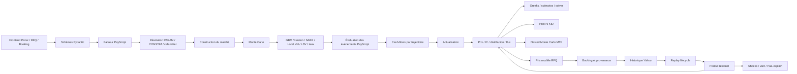

# Rapport d’audit quantitatif complet — STRUCTURA

**Date de l’audit :** 31 juillet 2026
**Révision examinée :** `4f7bffc`, avec worktree local non propre préexistant
**Périmètre :** pricing, payoffs, Monte Carlo, modèles, Greeks, volatilité, corrélations, lifecycle, dates, fixings, backtests, risque, PRIIPs KID, MTF, RFQ et chaîne de production.
**Hors périmètre :** AMC et INDEX_STUDIO.
**Mode opératoire :** audit en lecture seule. Aucun fichier de code ni test n’a été modifié pendant les travaux d’audit.

---

## 1. Résumé exécutif

### Verdict

**NO-GO pour une utilisation en production comme moteur officiel de valorisation, de Greeks, de risque ou de génération PRIIPs.**

Le moteur possède une base fonctionnelle intéressante et le GBM simple à taux plat donne de bons résultats sur les vanilles. Mais plusieurs défauts confirmés peuvent produire des valeurs financièrement incohérentes sans erreur technique visible.

Les blocages principaux sont :

1. incohérence entre courbe d’actualisation et drift des sous-jacents ;
2. Greeks des deals vivants calculés sans le spot courant ni l’état historique ;
3. Vega Heston cassant la propriété de martingale ;
4. MTF ne tenant pas compte des autocalls et de l’état complet antérieurs à la date future ;
5. calcul PRIIPs non conforme à la méthodologie réglementaire ;
6. cas de perte totale pouvant produire un MRM minimal ;
7. fixings passés susceptibles d’être simulés comme futurs ;
8. données Yahoo ajustées et rétropolées utilisées comme fixings contractuels ;
9. risque portefeuille ignorant le sens économique des positions ;
10. absence de preuve que le deal booké correspond au produit de la RFQ ;
11. prix modèle RFQ accepté depuis le client sans preuve de calcul ;
12. paramètres de RFQ modifiables après réception des cotations.

### Zone utilisable aujourd’hui

Le moteur peut servir de **prototype de recherche ou de calcul indicatif contrôlé** lorsque toutes les conditions suivantes sont respectées :

- payoff simple et vérifié indépendamment ;
- modèle `constant` ;
- taux plat ;
- pas de lifecycle déjà observé ;
- pas de barrière continue critique ;
- pas de KID réglementaire ;
- pas de MTF utilisé comme mesure de risque ;
- contrôle indépendant du résultat ;
- absence d’usage comme prix officiel ou limite de risque.

### Notation

| Domaine | Note /10 | Appréciation |
|---|---:|---|
| Exactitude des payoffs | 5,5 | Vanilles correctes, mais incohérences entre templates et absence de contrat économique typé |
| Qualité du Monte Carlo | 4,5 | Bon socle GBM, mais courbes, taux stochastiques et pas de temps problématiques |
| Exactitude des Greeks | 3,0 | Pré-trade vanille acceptable ; Greeks lifecycle et Heston non fiables |
| Gestion des dates | 2,5 | Grilles 52/252, absence de calendriers et fixings passés mal gérés |
| Qualité des données | 2,0 | Yahoo ajusté, absence d’as-of et règles de remplissage dangereuses |
| Robustesse numérique | 3,5 | Quelques garde-fous, mais validations incomplètes et réparations silencieuses |
| Qualité des backtests | 2,5 | Replay utile, mais biais de données, calendrier et sélection |
| Conformité réglementaire | 1,0 | PRIIPs non démontrable et plusieurs formules non conformes |
| Couverture des tests | 5,0 | 312 tests backend passent, mais les principaux invariants de production manquent |
| Maintenabilité quantitative | 4,0 | Moteur central lisible, mais trop de sémantiques implicites et dupliquées |
| **Note quantitative globale** | **3,4/10** | **Prototype avancé, non validé production** |

---

## 2. Cartographie du moteur quantitatif

### Principaux composants

- moteur principal : `backend/app/core/payscript/engine.py` ;
- parseur PayScript : `backend/app/core/payscript/parser.py` ;
- templates : `frontend/src/data/payscriptTemplates.js` ;
- API de pricing : `backend/app/api/pricing.py` ;
- lifecycle et deals : `backend/app/api/deals.py` ;
- PRIIPs : `backend/app/api/kid.py` ;
- RFQ : `backend/app/api/rfq.py` ;
- market data : `backend/app/services/market_data.py` ;
- VaR : `backend/app/core/var_engine.py`.

### Unités et conventions

| Donnée | Convention |
|---|---|
| Prix moteur | Fraction du nominal : `0.985 = 98,5 %` |
| Prix RFQ/deal | Points de nominal : `98.5` |
| Spot simulé | Normalisé à 1 au départ |
| Volatilité, taux, dividende | Fraction dans le backend |
| Affichage frontend | Pourcentage, puis division par 100 |
| Temps MC | Années, grille fixe de 52 pas/an |
| CONSTAT absolu | Écart calendaire divisé par 365,25 |
| Backtest | 252 lignes de données par an |
| Seed par défaut | 42 |
| Nombre de simulations | 20 000 observations ; antithétique = 40 000 trajectoires mais 20 000 paires |
| Marché par défaut | `r=3 %`, `q=2 %`, `sigma=20 %` |
| Monitoring barrière | Hebdomadaire par défaut |

### Endroits où l’information peut être perdue ou transformée

- conversion frontend pourcentage → fraction ;
- conversion prix moteur 0–1 → prix RFQ 0–100 ;
- résolution des CONSTAT en fractions d’année ;
- arrondi des dates sur la grille hebdomadaire ;
- arrondi du prix à six décimales avant certains calculs dérivés ;
- perte des métadonnées `monitors` après `resolve_constats` ;
- perte d’une partie de l’état entre lifecycle, Greeks et MTF ;
- fallbacks sur taux, dividendes, FX et corrélations ;
- utilisation d’un prix principal ancien avec des paramètres analytiques courants.

---

## 3. Produits et modèles identifiés

### Produits

Seize templates sont proposés :

- Autocall Athena ;
- Phoenix à coupon conditionnel ;
- Worst-of Athena ;
- Autocall Gear Put ;
- Autocall Gear Put worst-of ;
- call ;
- put ;
- call spread ;
- digital ;
- capital garanti ;
- reverse convertible ;
- Twin Win ;
- Booster ;
- Shark Note ;
- Shark Note worst-of ;
- zéro-coupon.

Le langage PayScript permet également des structures ad hoc avec `PARAM`, `CONSTAT`, `SET`, `PAY`, `FLOW`, `ACCRUE`, `STOP`, `WOF`, `BOF`, `WOF_MIN`, `BOF_MAX`, `S[i]`, `S_MIN`, `S_MAX`, `S_PREV`, `BASKET`, `FIX_MIN/MAX/AVG` et `REALVOL`.

### Modèles

- GBM à volatilité constante ;
- Heston avec discrétisation QE approchée ;
- SABR simulé par schéma log-Euler/CEV ;
- volatilité locale « Dupire-like » issue d’un smile polynomial ;
- LSV par méthode particulaire ;
- taux déterministes plats ou courbe zéro-coupon ;
- taux gaussiens ABM ou OU présenté comme Hull-White ;
- pont brownien pour monitoring continu approché.

---

## 4. Registre des anomalies critiques confirmées

### QNT-001 — Courbe de taux incohérente entre drift et actualisation

**Catégorie :** modèle
**Statut :** confirmé
**Sévérité :** critique
**Probabilité :** forte
**Fichier :** `backend/app/core/payscript/engine.py`
**Fonctions :** `_build_df_arr`, `_simulate_gbm`, `run_mc`
**Lignes concernées :** 222-259, 610-641, 1097-1202
**Comportement observé :** la courbe est utilisée pour actualiser, mais le drift des actifs continue d’utiliser le taux plat `r_eff`.
**Comportement attendu :** le drift doit être cohérent avec la courbe et le numéraire utilisés pour l’actualisation.
**Justification mathématique :** un actif prépayé doit valoir `S0 exp(-qT)`.
**Scénario de reproduction :** payoff linéaire, `r=3 %`, `q=2 %`, courbe plate à `1 %`, maturité 1 an : moteur `0,999989`, valeur correcte `0,980199`.
**Impact sur le prix :** environ +1,98 point de nominal dans le benchmark.
**Impact sur les Greeks :** carry et sensibilités taux incorrects.
**Impact utilisateur :** prix apparemment valide mais non arbitrage-free.
**Impact réglementaire :** contamine KID et valorisations documentaires.
**Correction recommandée :** objet marché unique dont forwards, drifts et discount factors proviennent de la même courbe.
**Tests à ajouter :** actif linéaire, forward, prepaid forward et parité call-put sous courbe non plate.
**Risque de régression :** élevé.

### QNT-002 — Greeks des deals vivants calculés comme un produit neuf

**Catégorie :** Greeks
**Statut :** confirmé
**Sévérité :** critique
**Probabilité :** forte
**Fichier :** `backend/app/api/deals.py`
**Fonction :** `deal_greeks`
**Lignes concernées :** 1816-1857, à comparer avec 1680-1699
**Comportement observé :** le MTM transporte spot, mémoire, index, extrema, fixings et realized vol ; `deal_greeks` ne les transmet pas à `compute_greeks`.
**Comportement attendu :** chaque jambe bumpée doit repartir du même état lifecycle que le MTM.
**Justification financière :** la sensibilité après plusieurs observations n’est pas celle du produit à l’émission.
**Scénario de reproduction :** deal Phoenix avec coupon mémoire ou KI déjà touchée.
**Impact sur le prix :** MTM de référence potentiellement correct, prix bumpés incohérents.
**Impact sur les Greeks :** Delta, Gamma, Vega, Theta et corrélation faux.
**Impact utilisateur :** hedge et agrégation portefeuille erronés.
**Impact réglementaire :** risque de mauvaise valorisation indépendante.
**Correction recommandée :** rendre `compute_greeks` stateful ou réutiliser `_residual_greeks`.
**Tests à ajouter :** KI touchée, mémoire, spot courant différent de 100 et strike fixing partiel.
**Risque de régression :** élevé.

### QNT-003 — Vega Heston casse la martingale

**Catégorie :** Greeks / modèle
**Statut :** confirmé
**Sévérité :** critique
**Probabilité :** forte
**Fichier :** `backend/app/core/payscript/engine.py`
**Fonctions :** `_simulate_heston`, `compute_greeks`
**Lignes concernées :** 320-333, 1429-1433
**Comportement observé :** `vol_add` augmente `sqrt(V)` mais le drift conserve la correction `-0,5 V`.
**Comportement attendu :** compensation de drift cohérente ou bump de paramètres Heston recalibrés.
**Scénario de reproduction :** payoff linéaire sous Heston ; Vega théorique nul, Vega moteur `0,08955`.
**Impact sur le prix :** prix bumpés non martingales.
**Impact sur les Greeks :** Vega Heston invalide.
**Impact utilisateur :** stress vol et hedge faux.
**Impact réglementaire :** valorisations et risques non défendables.
**Correction recommandée :** définir un Vega de surface ou de paramètres calibrés.
**Tests à ajouter :** Vega nul d’un payoff linéaire et martingale après bump.
**Risque de régression :** élevé.

### QNT-004 — MTF ne représente pas correctement le produit encore vivant

**Catégorie :** simulation
**Statut :** confirmé
**Sévérité :** critique
**Probabilité :** forte
**Fichier :** `backend/app/core/payscript/engine.py`
**Fonction :** `run_mark_to_future`
**Lignes concernées :** 1760-1968
**Comportement observé :** l’outer n’exécute pas les événements avant `t0`, un produit autocalled reste vivant, seuls `WOF_MIN` et `BOF_MAX` sont transmis et l’outer est toujours GBM.
**Comportement attendu :** état contractuel complet ou statut terminated par trajectoire outer.
**Scénario de reproduction :** Athena autocalled à la première observation ; la fan MTF continue.
**Impact sur le prix :** distribution de marks fausse.
**Impact sur les Greeks :** non directement calculés, mais métriques de risque incohérentes.
**Impact utilisateur :** faux percentiles et fausse probabilité de revalorisation.
**Impact réglementaire :** scénarios documentaires non fiables.
**Correction recommandée :** évaluer les événements et transporter l’état complet dans l’outer.
**Tests à ajouter :** autocall, mémoire, `INDEX`, strike fixing, Heston et courbe.
**Risque de régression :** élevé.

### QNT-005 — Méthodologie PRIIPs et formule VEV incorrectes

**Catégorie :** réglementation
**Statut :** confirmé
**Sévérité :** critique
**Probabilité :** forte
**Fichier :** `backend/app/api/kid.py`
**Fonctions :** `_mc_percentiles`, `kid_compute`
**Lignes concernées :** 60-180
**Comportement observé :** percentiles d’un MC risque-neutre et VEV `sqrt(-2 ln(p1)/T)`.
**Comportement attendu :** méthodologie historique/bootstrap de Catégorie 3 et formule réglementaire price-space.
**Justification :** la formule corrigée contient notamment `3.842` et `1.96`, absents du code.
**Scénario de reproduction :** comparer un vecteur réglementaire de référence au code.
**Impact sur le prix :** scénarios non comparables à la méthodologie réglementaire.
**Impact sur les Greeks :** sans objet direct.
**Impact utilisateur :** SRI et scénarios trompeurs.
**Impact réglementaire :** critique.
**Correction recommandée :** moteur PRIIPs indépendant et versionné.
**Tests à ajouter :** cas officiels Catégorie 3 et non-régression par version RTS.
**Risque de régression :** élevé.

Références officielles :

- [Corrigendum du règlement 2017/653](https://eur-lex.europa.eu/legal-content/EN/TXT/PDF/?uri=CELEX%3A32017R0653R%2801%29)
- [Version consolidée du règlement PRIIPs](https://eur-lex.europa.eu/legal-content/EN/TXT/?qid=1716481691756&uri=CELEX%3A02017R0653-20230101)
- [Règlement délégué 2021/2268](https://eur-lex.europa.eu/legal-content/EN/TXT/?uri=CELEX%3A32021R2268)

### QNT-006 — Une perte totale peut donner MRM 1

**Catégorie :** réglementation
**Statut :** confirmé
**Sévérité :** critique
**Probabilité :** forte
**Fichier :** `backend/app/api/kid.py`
**Fonction :** `kid_compute`
**Lignes concernées :** 175-183
**Comportement observé :** si `p1 <= 0`, la VEV est forcée à zéro puis le MRM devient 1.
**Comportement attendu :** une perte totale ne peut pas être classée risque minimal.
**Scénario de reproduction :** au moins 1 % des trajectoires avec payoff nul.
**Impact sur le prix :** aucun sur la fair value ; classement de risque inversé.
**Impact sur les Greeks :** aucun direct.
**Impact utilisateur :** information investisseur fausse.
**Impact réglementaire :** critique.
**Correction recommandée :** traitement réglementaire explicite des valeurs nulles/non logarithmables.
**Tests à ajouter :** perte totale, payoff négatif et percentile nul.
**Risque de régression :** moyen.

### QNT-007 — Horizons intermédiaires KID déclenchant artificiellement la maturité

**Catégorie :** réglementation / simulation
**Statut :** confirmé
**Sévérité :** critique
**Probabilité :** forte
**Fichiers :** `backend/app/api/kid.py`, `backend/app/core/payscript/engine.py`
**Lignes concernées :** KID 60-87 et 150-192 ; engine 1144-1158
**Comportement observé :** l’horizon est raccourci puis `AT MATURITY` est exécuté comme si le contrat arrivait à maturité.
**Comportement attendu :** valeur du produit encore vivant à l’horizon intermédiaire.
**Scénario de reproduction :** autocall 5 ans évalué à 1 an.
**Impact sur le prix :** MTM intermédiaire remplacé par un payoff anticipé.
**Impact sur les Greeks :** sans objet direct.
**Impact utilisateur :** scénarios et rendements annualisés faux.
**Impact réglementaire :** critique.
**Correction recommandée :** revalorisation résiduelle réglementaire.
**Tests à ajouter :** produits autocalled et non monotones aux horizons intermédiaires.
**Risque de régression :** élevé.

### QNT-008 — Fixings passés simulés et fixings officiels non prioritaires

**Catégorie :** dates
**Statut :** confirmé
**Sévérité :** critique
**Probabilité :** forte
**Fichiers :** `parser.py`, `engine.py`, `deals.py`
**Fonctions :** `resolve_constats`, `run_mc`, lifecycle
**Lignes concernées :** parser 622-731 ; engine 1144-1158
**Comportement observé :** un CONSTAT passé produit un temps négatif puis est clampé au pas 1 ; le replay privilégie l’historique Yahoo sur un fixing officiel.
**Comportement attendu :** observation passée certaine, validée ou explicitement manquante.
**Scénario de reproduction :** ancre au 31 juillet et CONSTAT au 30 juillet.
**Impact sur le prix :** statut autocall, coupon et KI potentiellement faux.
**Impact sur les Greeks :** état initial des bumps incorrect.
**Impact utilisateur :** deal déjà observé traité comme futur.
**Impact réglementaire :** valorisation non reproductible.
**Correction recommandée :** fixing store officiel et séparation stricte passé/futur.
**Tests à ajouter :** date passée, date du jour, correction et jour férié.
**Risque de régression :** élevé.

### QNT-009 — Look-ahead et prix ajustés dans les données historiques

**Catégorie :** données / backtest
**Statut :** confirmé
**Sévérité :** critique
**Probabilité :** forte
**Fichier :** `backend/app/services/market_data.py`
**Fonction :** `load_hist_prices`
**Lignes concernées :** 107-130
**Comportement observé :** `auto_adjust=True`, union des calendriers et `ffill().bfill()`. Le passé pré-IPO peut être rempli par le premier prix futur.
**Comportement attendu :** aucune donnée future dans le passé et politique corporate-action explicite.
**Scénario de reproduction :** panier avec un actif introduit après le début du backtest.
**Impact sur le prix :** fixings historiques artificiels.
**Impact sur les Greeks :** vol/corr historiques biaisées.
**Impact utilisateur :** backtests surévalués.
**Impact réglementaire :** données non défendables.
**Correction recommandée :** supprimer le backward fill et séparer raw/adjusted close.
**Tests à ajouter :** IPO, split, dividende et calendriers multi-pays.
**Risque de régression :** moyen.

La documentation yfinance confirme que `end` est exclusif et `auto_adjust` vaut `True` par défaut : [PriceHistory](https://ranaroussi.github.io/yfinance/reference/yfinance.price_history.html).

### QNT-010 — Sens économique des positions ignoré par le risque portefeuille

**Catégorie :** robustesse
**Statut :** confirmé
**Sévérité :** critique
**Probabilité :** forte
**Fichiers :** `portfolios.py`, `shocks.py`, `var_engine.py`
**Lignes concernées :** portfolios 154-225 ; shocks 90-154 ; var 45-136
**Comportement observé :** multiplication par nominal sans signe long/short dérivé de `deal.sens`.
**Comportement attendu :** une position opposée inverse MTM, Greeks, P&L et pertes.
**Scénario de reproduction :** deux deals identiques avec sens opposés.
**Impact sur le prix :** agrégat de portefeuille de mauvais signe.
**Impact sur les Greeks :** les risques s’additionnent au lieu de s’annuler.
**Impact utilisateur :** hedge et limites faux.
**Impact réglementaire :** risque de reporting erroné.
**Correction recommandée :** convention de position unique et immuable.
**Tests à ajouter :** long + short identiques = zéro.
**Risque de régression :** élevé.

### QNT-011 — Deal différent pouvant être booké sous la provenance d’une RFQ

**Catégorie :** robustesse / données
**Statut :** confirmé
**Sévérité :** critique
**Probabilité :** forte
**Fichiers :** `frontend/src/stores/pricing.js`, `backend/app/api/deals.py`
**Lignes concernées :** pricing 998-1099 ; deals 295-320
**Comportement observé :** les termes peuvent être modifiés dans le Pricer après chargement RFQ ; le backend ne compare pas le deal aux termes mis en concurrence.
**Comportement attendu :** identité économique RFQ/deal ou divergence documentée et approuvée.
**Scénario de reproduction :** modifier coupon ou sous-jacent avant booking.
**Impact sur le prix :** fair value et quote concernent potentiellement des produits différents.
**Impact sur les Greeks :** risque booké différent du risque RFQ.
**Impact utilisateur :** marge et contrepartie mal attribuées.
**Impact réglementaire :** piste de best execution non probante.
**Correction recommandée :** hash canonique des termes vérifié au booking.
**Tests à ajouter :** mutation script, calendrier, sous-jacent et nominal.
**Risque de régression :** moyen.

### QNT-012 — Prix modèle RFQ non prouvé et termes mutables

**Catégorie :** données / robustesse
**Statut :** confirmé
**Sévérité :** critique
**Probabilité :** forte
**Fichiers :** `frontend/src/stores/rfq.js`, `backend/app/api/rfq.py`, `frontend/src/views/RfqView.vue`
**Lignes concernées :** rfq.js 118-145 ; rfq.py 462-510 ; vue 1213-1253
**Comportement observé :** prix calculé côté client puis accepté par PATCH ; absence de seed, IC, hash et version moteur ; paramètres modifiables après quote.
**Comportement attendu :** calcul serveur atomique et snapshot immuable.
**Scénario de reproduction :** modifier les paramètres après quote sans recalculer le prix.
**Impact sur le prix :** edge RFQ incohérent ou manipulable.
**Impact sur les Greeks :** aucune preuve qu’ils correspondent au même snapshot.
**Impact utilisateur :** comparaison banques/modèle fausse.
**Impact réglementaire :** best execution fragilisée.
**Correction recommandée :** endpoint `compute-and-freeze`, versionnage et invalidation automatique.
**Tests à ajouter :** PATCH manuel, anciens prix/nouveaux termes et concurrence déjà commencée.
**Risque de régression :** moyen.

---

## 5. Anomalies probables

### QNT-013 — Ambiguïtés économiques dans plusieurs templates

**Catégorie :** payoff
**Statut :** probable
**Sévérité :** élevée
**Probabilité :** forte
**Fichier :** `frontend/src/data/payscriptTemplates.js`
**Lignes concernées :** 26-213
**Comportement observé :** Athena simple à KI terminale, Worst-of Athena à KI path-dependent, Shark worst-of avec KO sur `BOF_MAX`, Gear Put exprimé relativement au strike et Booster potentiellement discontinu.
**Comportement attendu :** correspondance documentée à une term sheet de référence.
**Scénario de reproduction :** trajectoires touchant une barrière puis revenant à maturité.
**Impact sur le prix :** potentiellement plusieurs points.
**Impact sur les Greeks :** sensibilités barrières très différentes.
**Impact utilisateur :** template choisi différent du produit attendu.
**Impact réglementaire :** documentation potentiellement incohérente.
**Correction recommandée :** spécification économique et golden scenarios par template.
**Tests à ajouter :** égalité, juste au-dessus et juste au-dessous des barrières.
**Risque de régression :** moyen.

### QNT-014 — Pont brownien approximatif pour les modèles non GBM

**Catégorie :** simulation
**Statut :** probable
**Sévérité :** élevée
**Probabilité :** moyenne
**Fichier :** `backend/app/core/payscript/engine.py`
**Fonction :** `_bridge_extrema`
**Lignes concernées :** 579-608
**Comportement observé :** volatilité gelée par pas ; minimum et maximum tirés séparément.
**Comportement attendu :** loi conditionnelle cohérente avec le modèle et loi jointe des extrema.
**Impact sur le prix :** biais KI/KO continu sous Heston, SABR, LV et LSV.
**Impact sur les Greeks :** sensibilités de barrière instables.
**Impact utilisateur :** label « continu » trop fort.
**Impact réglementaire :** dépend de la documentation produit.
**Correction recommandée :** limiter l’exactitude annoncée au GBM ou utiliser une méthode adaptée.
**Tests à ajouter :** barrière analytique GBM et convergence par modèle.
**Risque de régression :** élevé.

### QNT-015 — SABR, Local Vol et LSV sans chaîne de calibration production

**Catégorie :** volatilité
**Statut :** probable
**Sévérité :** élevée
**Probabilité :** forte
**Fichier :** `backend/app/core/payscript/engine.py`
**Lignes concernées :** 47-211, 339-578
**Comportement observé :** smile polynomial, clamps, fallbacks, schéma SABR spot/CEV et LSV par buckets ; aucune calibration à des quotes implicites n’est visible.
**Comportement attendu :** surface arbitrage-free, métriques d’erreur et provenance de calibration.
**Impact sur le prix :** exotiques sensibles au forward skew mal pricés.
**Impact sur les Greeks :** Vega et smile Greeks non interprétables comme risques de marché.
**Impact utilisateur :** choix de modèle donne une sophistication apparente non validée.
**Impact réglementaire :** modèle difficile à défendre.
**Correction recommandée :** séparer démonstrateurs et modèles calibrés officiels.
**Tests à ajouter :** repricing surface, butterfly et calendar arbitrage.
**Risque de régression :** élevé.

### QNT-016 — Convention quanto/FX non suffisamment spécifiée

**Catégorie :** modèle
**Statut :** probable
**Sévérité :** élevée
**Probabilité :** moyenne
**Fichier :** `backend/app/core/payscript/engine.py`
**Lignes concernées :** 247-257 et équivalents des autres simulateurs
**Comportement observé :** ajustement `ccyh - sigma_fx*rho_sfx*sigma` sans définition complète de la paire FX et des devises.
**Comportement attendu :** mesure domestique, paire FX et signe de corrélation explicités.
**Impact sur le prix :** quanto adjustment potentiellement inversé.
**Impact sur les Greeks :** FX/quanto sensitivities non fiables.
**Impact utilisateur :** erreur de carry cross-currency.
**Impact réglementaire :** non vérifiable.
**Correction recommandée :** objet devise typé et benchmarks quanto fermés.
**Tests à ajouter :** inversion de paire, rho positif/négatif et sigma FX nulle.
**Risque de régression :** élevé.

---

## 6. Risques théoriques et non vérifiables

### QNT-017 — NaN, infinis et paramètres extrêmes insuffisamment bloqués

**Catégorie :** robustesse
**Statut :** hypothétique
**Sévérité :** élevée
**Probabilité :** moyenne
**Fichiers :** `schemas.py`, `engine.py`
**Comportement observé :** contraintes limitées sur `T`, taux, vol, paramètres Heston/SABR et valeurs finies.
**Comportement attendu :** rejet de toute entrée non finie ou économiquement impossible.
**Scénarios :** `xi=0`, `kappa<0`, `v0<0`, rho hors bornes, NaN ou choc spot inférieur à -100 %.
**Impact sur le prix :** erreur runtime ou résultat clampé.
**Impact sur les Greeks :** différences finies non finies.
**Impact utilisateur :** résultat illisible ou faux.
**Impact réglementaire :** données invalides non maîtrisées.
**Correction recommandée :** validations modèle-spécifiques et `isfinite`.
**Tests à ajouter :** fuzzing des schémas.
**Risque de régression :** faible.

### QNT-018 — Risque d’épuisement mémoire

**Catégorie :** performance
**Statut :** probable
**Sévérité :** élevée
**Probabilité :** moyenne
**Fichier :** `backend/app/core/payscript/engine.py`
**Fonction :** `run_mc`
**Lignes concernées :** 1178-1306
**Comportement observé :** tenseurs temps × actifs × chemins pour normales, spots et volatilités de bridge.
**Comportement attendu :** chunking et budget mémoire.
**Scénario de reproduction :** 30 ans, plusieurs actifs, 200 000 chemins, monitoring continu.
**Impact sur le prix :** calcul interrompu.
**Impact sur les Greeks :** multiplication du coût par le nombre de bumps.
**Impact utilisateur :** OOM ou indisponibilité.
**Impact réglementaire :** impossibilité de reproduire certains calculs.
**Correction recommandée :** agrégation statistique par chunks.
**Tests à ajouter :** limites mémoire et égalité statistique chunké/non chunké.
**Risque de régression :** élevé.

### QNT-019 — Conformité juridique finale non vérifiable

**Catégorie :** réglementation
**Statut :** non vérifiable avec les éléments disponibles
**Sévérité :** critique
**Probabilité :** forte
**Fichiers :** ensemble KID, templates et stockage documentaire
**Comportement observé :** absence de matrice réglementaire complète, version RTS, validation juridique et source des coûts implicites.
**Comportement attendu :** gouvernance formelle et piste de calcul reproductible.
**Impact sur le prix :** aucun direct.
**Impact sur les Greeks :** aucun direct.
**Impact utilisateur :** document pouvant sembler officiel sans validation.
**Impact réglementaire :** critique.
**Correction recommandée :** validation juridique indépendante après reconstruction du moteur.
**Tests à ajouter :** jeux de référence approuvés par Compliance.
**Risque de régression :** élevé.

---

## 7. Résultats des benchmarks indépendants

### Black-Scholes, 1 an

Hypothèses : `S0=K=1`, `r=3 %`, `q=2 %`, `sigma=20 %`, 30 000 paires antithétiques, seed 123.

| Instrument | Moteur | Référence | Écart |
|---|---:|---:|---:|
| Call | 0,082718 | 0,0826633 | +0,547 bp de nominal |
| Put | 0,072976 | 0,0729101 | +0,659 bp |
| Call − Put | 0,009742 | 0,0097531 | −0,111 bp |
| ZCB | 0,970446 | 0,9704455 | négligeable |

IC 95 % du call : `[0,081895 ; 0,083541]`.

**Conclusion :** le GBM à taux plat et les vanilles constituent un bon socle.

### Greeks Black-Scholes

| Greek | Moteur | Référence |
|---|---:|---:|
| Delta | 0,5472 | 0,54854 |
| Gamma | 1,9967 | 1,93334 |
| Vega | 0,3839 | 0,38667 |
| Rho | 0,4650 | 0,46587 |

### Convergence en nombre de chemins

| N | Prix moyen | Écart-type entre seeds | Largeur moyenne IC 95 % |
|---:|---:|---:|---:|
| 1 000 | 0,081516 | 0,002796 | 0,008838 |
| 5 000 | 0,081657 | 0,001018 | 0,004012 |
| 20 000 | 0,082424 | 0,000245 | 0,002025 |

La décroissance est compatible avec `1/sqrt(N)`, sans constituer une validation des queues d’exotiques ou des nested simulations.

### Cas courts et grille temporelle

| Maturité | Prix ZCB moteur | Valeur exacte |
|---|---:|---:|
| 0 jour | 0,999423 | 1,000000 |
| 1 jour | 0,999423 | 0,999918 |
| 3 jours | 0,999423 | 0,999754 |
| 7 jours | 0,999423 | 0,999425 |
| 10 jours | 0,999423 | 0,999178 |

Toute maturité inférieure à environ 1,5 semaine devient un pas hebdomadaire.

### Modèles sur payoff linéaire

Référence `exp(-qT)=0,980199`.

| Modèle | Prix |
|---|---:|
| GBM | 0,980426 |
| Heston | 0,979858 |
| SABR | 0,980005 |
| Local Vol | 0,980199 |
| LSV | 0,979889 |

### Taux stochastiques

ZCB 5 ans, courbe plate 3 % :

| Vol de taux | Prix moteur | Prix exact courbe |
|---:|---:|---:|
| 0 % | 0,860708 | 0,860708 |
| 1 % | 0,861389 | 0,860708 |
| 2 % | 0,863434 | 0,860708 |
| 3 % | 0,866854 | 0,860708 |

À 3 %, l’écart atteint environ **61,5 bp de prix**.

---

## 8. Analyse des payoffs

Soit `X(t)=min_i(S_i(t)/S_i(0))`, `m(t)=min_{u<=t} X(u)` et `M(t)=max_{u<=t} max_i(S_i(u)/S_i(0))`.

| Produit | Formule reconstituée |
|---|---|
| Athena | Autocall en `j` : `1+jC`. Sinon `1` si `X(T)>=B_KI`, sinon `X(T)` |
| Phoenix | Coupons `C 1{X(j)>=B_C}`, remboursement 1 à l’autocall ; à maturité 1 ou `X(T)` selon KI |
| Worst-of Athena | Même rappel, mais perte si `m(T)<B_KI` |
| Gear Put | `1-min(1,g max(0,1-X(T)/K_P))` hors autocall |
| Call | `max(X(T)-K,0)` |
| Put | `max(K-X(T),0)` |
| Call spread | `max(0,min(X(T)-K1,K2-K1))` |
| Digital | `R 1{X(T)>=K}` |
| Capital garanti | `1+p max(X(T)-K,0)` |
| Reverse convertible | `C+1` si `X(T)>=B`, sinon `C+X(T)` |
| Twin Win | barrière intacte : `min(Cap,1+abs(X(T)-1))`, sinon `X(T)` |
| Booster | hausse : `min(Cap,Floor+p(X(T)-1))`, baisse : `min(1,X(T))` |
| Shark Note | `1+Call` sans KO ; `1+Rebate` si KO |
| Shark worst-of | Call sur le worst-of ; KO basé sur le best-of historique |
| ZCB | 1 à maturité |

### Cas limites

- Les barrières KI utilisent `<` : l’égalité est considérée comme non franchie.
- Les autocalls et digitals utilisent `>=` : l’égalité déclenche.
- Le KO Shark utilise `>=`.
- Le principal dépend entièrement du script : il n’est pas garanti qu’il soit payé une fois.
- Aucun contrôle ne garantit `K2>K1`, `Cap>=Floor`, coupon positif ou barrières cohérentes.
- Le Phoenix fourni ne possède pas de mémoire de coupon.
- Les payoffs sont normalisés au nominal 1.

### QNT-020 — `PAY` direct d’un `PARAM()` provoque une erreur

**Catégorie :** payoff
**Statut :** confirmé
**Sévérité :** élevée
**Probabilité :** forte
**Fichier :** `parser.py`
**Fonction :** `_compile_body`
**Lignes concernées :** 297-306
**Comportement observé :** le transpileur de `PAY` n’envoie pas `array_params`.
**Comportement attendu :** sélection de la valeur correspondant à l’observation.
**Scénario de reproduction :** `PARAM C=(1%,2%)`, puis `PAY C` ; TypeError.
**Impact sur le prix :** pricing impossible.
**Impact sur les Greeks :** calcul impossible.
**Impact utilisateur :** script valide en apparence mais inexécutable.
**Impact réglementaire :** dépend du produit.
**Correction recommandée :** même résolution que `SET`, `IF` et `ACCRUE`.
**Tests à ajouter :** `PARAM()` dans chaque instruction DSL.
**Risque de régression :** faible.

### QNT-021 — Faiblesses d’indexation et de panier

**Catégorie :** payoff / robustesse
**Statut :** confirmé
**Sévérité :** moyenne
**Probabilité :** forte
**Fichier :** `parser.py`
**Lignes concernées :** 167-229, 622-731
**Comportement observé :** `S[0]` pointe le dernier actif ; poids excédentaires de `BASKET` au dénominateur ; perte de `monitors` après résolution.
**Comportement attendu :** indices 1..N, cardinalité des poids exacte et métadonnées conservées.
**Impact sur le prix :** payoff silencieusement différent.
**Impact sur les Greeks :** association au mauvais actif.
**Impact utilisateur :** monitoring et résultats trompeurs.
**Impact réglementaire :** documentation incorrecte possible.
**Correction recommandée :** validation statique du DSL.
**Tests à ajouter :** indices 0/N+1, poids excédentaires et round-trip.
**Risque de régression :** faible.

### QNT-022 — Horizon étendu silencieusement

**Catégorie :** dates / payoff
**Statut :** confirmé
**Sévérité :** élevée
**Probabilité :** forte
**Fichier :** `parser.py`
**Fonction :** `effective_T_max`
**Lignes concernées :** 734-748
**Comportement observé :** un événement après `T` étend la maturité et déplace `AT MATURITY`.
**Comportement attendu :** conflit explicite entre tenor et calendrier.
**Impact sur le prix :** duration et remboursement changés.
**Impact sur les Greeks :** Theta et Rho différents.
**Impact utilisateur :** échéance différente de celle affichée.
**Impact réglementaire :** document potentiellement incohérent.
**Correction recommandée :** bloquer ou demander confirmation.
**Tests à ajouter :** `T` inférieur/supérieur à la dernière date.
**Risque de régression :** moyen.

### QNT-023 — Relations économiques entre paramètres non validées

**Catégorie :** payoff
**Statut :** confirmé
**Sévérité :** élevée
**Probabilité :** forte
**Fichiers :** schémas et templates
**Comportement observé :** aucune contrainte sur cap/floor, strikes, barrières, participation, gearing ou coupon.
**Comportement attendu :** domaine économique défini par produit.
**Scénario de reproduction :** `K2<K1`, gearing négatif, floor incohérent.
**Impact sur le prix :** payoff négatif ou discontinu.
**Impact sur les Greeks :** sensibilités sans interprétation économique.
**Impact utilisateur :** produit invalide calculé sans blocage.
**Impact réglementaire :** documentation incohérente.
**Correction recommandée :** schéma typé par produit.
**Tests à ajouter :** toutes les relations d’ordre.
**Risque de régression :** moyen.

---

## 9. Analyse Monte Carlo

### Éléments correctement conçus

- formule GBM correcte à taux plat ;
- terme `-0,5 sigma²` présent ;
- diffusion multipliée par `sqrt(dt)` ;
- seed déterministe ;
- common random numbers ;
- antithétiques appariés avant l’erreur standard ;
- actualisation des cash-flows à leur date ;
- intervalle de confiance basé sur les moyennes des paires.

### QNT-024 — Grille hebdomadaire imposée à tous les événements

**Catégorie :** simulation / dates
**Statut :** confirmé
**Sévérité :** élevée
**Probabilité :** forte
**Fichier :** `engine.py`
**Lignes concernées :** 20, 1137-1158
**Comportement observé :** `SY=52`, `round(T*52)` et minimum un pas.
**Comportement attendu :** grille contenant les dates contractuelles et convergence temporelle.
**Impact sur le prix :** maturités courtes et barrières biaisées.
**Impact sur les Greeks :** Theta et Gamma près d’événements instables.
**Impact utilisateur :** dates rapprochées fusionnées.
**Impact réglementaire :** horizons inexacts.
**Correction recommandée :** grille irrégulière par événements avec sous-pas configurables.
**Tests à ajouter :** 0/1/3/7 jours et convergence 52/104/252/504.
**Risque de régression :** élevé.

### QNT-025 — Le taux « Hull-White » ne refitte pas exactement la courbe

**Catégorie :** modèle
**Statut :** confirmé
**Sévérité :** élevée
**Probabilité :** forte
**Fichier :** `engine.py`
**Lignes concernées :** 644-694
**Comportement observé :** `r=f(0,t)+x(t)` avec OU centré, sans shift de convexité.
**Comportement attendu :** reproduction exacte de la courbe initiale.
**Justification :** `E[exp(-integral x dt)]` n’est pas égal à 1 si la variance est positive.
**Impact sur le prix :** écart jusqu’à 61,5 bp sur ZCB 5 ans dans le benchmark.
**Impact sur les Greeks :** risque taux biaisé.
**Impact utilisateur :** modèle annoncé plus exact qu’il ne l’est.
**Impact réglementaire :** valorisation difficile à défendre.
**Correction recommandée :** calibrer la dérive Hull-White ou renommer le modèle.
**Tests à ajouter :** ZCB à chaque pilier pour plusieurs `a` et `sigma_r`.
**Risque de régression :** élevé.

### QNT-026 — Corrélations actions modifiées par le facteur taux

**Catégorie :** corrélation
**Statut :** confirmé
**Sévérité :** élevée
**Probabilité :** forte
**Fichier :** `engine.py`
**Fonction :** `_blend_rate_factor`
**Lignes concernées :** 697-703
**Comportement observé :** après mélange avec le taux, la corrélation action-action n’est plus celle saisie.
**Comportement attendu :** matrice jointe actions/taux cohérente.
**Impact sur le prix :** worst-of et baskets modifiés.
**Impact sur les Greeks :** corr Greek incohérent.
**Impact utilisateur :** dépendance différente du paramétrage.
**Impact réglementaire :** non vérifiable.
**Correction recommandée :** factorisation d’une matrice jointe.
**Tests à ajouter :** corrélations empiriques simulées.
**Risque de régression :** élevé.

### QNT-027 — Modèle inconnu et paramètres invalides insuffisamment contrôlés

**Catégorie :** modèle / robustesse
**Statut :** confirmé
**Sévérité :** élevée
**Probabilité :** forte
**Fichiers :** `schemas.py`, `engine.py`
**Lignes concernées :** schemas 6-51 ; engine 1167-1170
**Comportement observé :** un modèle inconnu retombe sur GBM ; paramètres Heston/SABR peu contraints.
**Comportement attendu :** rejet explicite.
**Impact sur le prix :** calcul sous un modèle différent.
**Impact sur les Greeks :** sensitivities mal attribuées.
**Impact utilisateur :** erreur silencieuse de configuration.
**Impact réglementaire :** modèle non traçable.
**Correction recommandée :** enum et validations conditionnelles.
**Tests à ajouter :** modèle inconnu, `xi=0`, rho hors bornes.
**Risque de régression :** faible.

### QNT-028 — Attribution des flux et arrondi prématuré

**Catégorie :** robustesse
**Statut :** confirmé
**Sévérité :** moyenne
**Probabilité :** forte
**Fichier :** `engine.py`
**Lignes concernées :** 1321-1376, calcul des Greeks
**Comportement observé :** flux calculés sur la jambe base puis rescalés ; prix arrondi à `1e-6` avant différences finies.
**Comportement attendu :** agrégation réelle des deux jambes et valeurs brutes internes.
**Impact sur le prix :** prix global peu affecté.
**Impact sur les Greeks :** erreur d’arrondi amplifiée en Gamma.
**Impact utilisateur :** explain de cash-flows inexact.
**Impact réglementaire :** valuation explain fragilisé.
**Correction recommandée :** flux antithétiques agrégés et arrondi à la restitution.
**Tests à ajouter :** somme des flux = prix et stabilité Gamma.
**Risque de régression :** moyen.

---

## 10. Analyse des Greeks

| Greek | Implémentation | Convention |
|---|---|---|
| Delta | `[P(1,01S)-P(0,99S)]/0,02` | dérivée par unité de spot normalisé |
| Gamma | `[P(1,03S)-2P(S)+P(0,97S)]/0,03²` | central |
| Vega | `[P(sigma+1pt)-P(sigma-1pt)]/0,02` | dérivée par 100 points de vol |
| Rho | `[P(r+100bp)-P(r-100bp)]/0,02` | dérivée par unité de taux |
| Theta | vieillissement d’une semaine, divisé par 7 | par jour calendaire |
| Corr | `[P(rho+5pt)-P(rho)]/0,05` | unilatéral |

### QNT-029 — Rho ne choque pas la courbe

**Catégorie :** Greeks
**Statut :** confirmé
**Sévérité :** élevée
**Probabilité :** forte
**Fichier :** `engine.py`
**Lignes concernées :** 1405-1467
**Comportement observé :** `dr` modifie le taux plat, pas la courbe. Un ZCB sous courbe peut avoir Rho nul.
**Comportement attendu :** parallèle de courbe ou key-rate bump défini.
**Impact sur le prix :** prix bumpés inchangés à tort.
**Impact sur les Greeks :** Rho faux.
**Impact utilisateur :** couverture de taux incorrecte.
**Impact réglementaire :** risque taux sous-estimé.
**Correction recommandée :** parallel rho et key-rate rhos.
**Tests à ajouter :** duration analytique d’un ZCB.
**Risque de régression :** élevé.

### QNT-030 — Theta et différences finies instables aux événements discrets

**Catégorie :** Greeks
**Statut :** confirmé
**Sévérité :** élevée
**Probabilité :** forte
**Fichier :** `engine.py`
**Lignes concernées :** 1435-1458
**Comportement observé :** vieillissement d’une semaine sans exécuter l’événement traversé ni mettre à jour l’état.
**Comportement attendu :** roll stateful par business date.
**Impact sur le prix :** prix âgé incohérent près d’un fixing.
**Impact sur les Greeks :** Theta faux ; digitals et barrières non différentiables.
**Impact utilisateur :** mauvaise mesure de carry.
**Impact réglementaire :** valuation explain erroné.
**Correction recommandée :** Theta lifecycle et diagnostics multi-bumps.
**Tests à ajouter :** veille/jour/après observation.
**Risque de régression :** élevé.

### Greeks absents ou insuffisamment définis

- sensibilité dividende ;
- key-rate rhos ;
- Vanna ;
- Volga ;
- Greeks sticky-strike/sticky-delta ;
- corrélations par facteur cohérentes ;
- erreurs standards ou diagnostics de bruit par Greek.

---

## 11. Volatilité, surfaces et corrélations

### QNT-031 — Surface locale non arbitrage-free

**Catégorie :** volatilité
**Statut :** confirmé
**Sévérité :** élevée
**Probabilité :** forte
**Fichier :** `engine.py`
**Lignes concernées :** 142-211
**Comportement observé :** smile polynomial, pas de vraie structure de terme, clamps et fallbacks silencieux.
**Comportement attendu :** surface de calls monotone, convexe et sans arbitrage calendaire.
**Impact sur le prix :** local vol artificielle et exotiques biaisés.
**Impact sur les Greeks :** smile risk non interprétable.
**Impact utilisateur :** sophistication apparente non calibrée.
**Impact réglementaire :** modèle non validable.
**Correction recommandée :** calibration sur prix arbitrage-free.
**Tests à ajouter :** convexité strike, monotonie maturité et repricing quotes.
**Risque de régression :** élevé.

### QNT-032 — Réparation silencieuse des corrélations et échec singulier

**Catégorie :** corrélation
**Statut :** confirmé
**Sévérité :** élevée
**Probabilité :** forte
**Fichier :** `engine.py`
**Fonction :** `cholesky`
**Lignes concernées :** 27-42
**Comportement observé :** matrice indéfinie réparée sans restituer la matrice utilisée ; une matrice PSD singulière peut échouer.
**Comportement attendu :** projection nearest-correlation documentée et reportée.
**Scénario de reproduction :** matrice `[[1,1],[1,1]]`.
**Impact sur le prix :** dépendance modifiée ou erreur runtime.
**Impact sur les Greeks :** corr sensitivities non reproductibles.
**Impact utilisateur :** matrice saisie différente de la matrice utilisée.
**Impact réglementaire :** hypothèses non traçables.
**Correction recommandée :** projection robuste avec seuil de matérialité.
**Tests à ajouter :** singulière, quasi-singulière et indéfinie.
**Risque de régression :** moyen.

---

## 12. Dates, fixings et calendriers

### QNT-033 — Absence de conventions contractuelles de calendrier et paiement

**Catégorie :** dates
**Statut :** confirmé
**Sévérité :** élevée
**Probabilité :** forte
**Fichiers :** `schedule.py`, `parser.py`, `engine.py`, lifecycle deals
**Comportement observé :** `/365.25`, pas de jours fériés, business-day convention, payment lag, day count, cutoff ou timezone.
**Comportement attendu :** conventions par produit et devise.
**Impact sur le prix :** observation et actualisation aux mauvaises dates.
**Impact sur les Greeks :** Theta et Rho affectés.
**Impact utilisateur :** calendrier affiché différent du contrat.
**Impact réglementaire :** échéanciers potentiellement faux.
**Correction recommandée :** schedule contractuel typé et versionné.
**Tests à ajouter :** Modified Following, leap year, month-end et jours fériés.
**Risque de régression :** élevé.

### Divergences lifecycle/backtest

- replay historique via `round(d*252)` lignes ;
- CONSTAT calculé en jours calendaires/365,25 ;
- produit résiduel filtré selon le temps calendaire écoulé ;
- maturité historique pilotée par `deal.T` plutôt que toujours par la date contractuelle ;
- événements du jour susceptibles d’utiliser la clôture précédente.

---

## 13. Backtests et risque

### QNT-034 — Backtests exposés à plusieurs biais matériels

**Catégorie :** backtest
**Statut :** confirmé
**Sévérité :** élevée
**Probabilité :** forte
**Fichiers :** `pricing.py`, `engine.py`
**Lignes concernées :** pricing 255-504 ; engine 2026-2276
**Comportement observé :** calendrier 252 lignes, adjusted prices, remplissages, fenêtres IRR échouées exclues, médiane paire incorrecte, chevauchement, absence de frais et shortlist data-mined.
**Comportement attendu :** protocole historique as-of et statistiques tenant compte du chevauchement.
**Impact sur le prix :** performances historiques surestimées.
**Impact sur les Greeks :** sans objet direct.
**Impact utilisateur :** sélection de sous-jacents biaisée.
**Impact réglementaire :** communication de performance fragile.
**Correction recommandée :** backtest événementiel calendaire et journal des exclusions.
**Tests à ajouter :** no-lookahead, IPO, flux multiples et IRR multiples.
**Risque de régression :** élevé.

### QNT-035 — VaR et Expected Shortfall fragiles

**Catégorie :** robustesse
**Statut :** confirmé
**Sévérité :** élevée
**Probabilité :** forte
**Fichiers :** `var.py`, `var_engine.py`
**Lignes concernées :** var API 36-108 ; engine 281-359
**Comportement observé :** paramètres peu bornés, gaussien à moyenne nulle, scénarios partiels conservés, ES avec une observation de trop, position non signée.
**Comportement attendu :** scénario atomique et quantile exact.
**Impact sur le prix :** delta MTM de scénario incomplet.
**Impact sur les Greeks :** agrégation non signée.
**Impact utilisateur :** VaR/ES sous-estimées ou de mauvais signe.
**Impact réglementaire :** reporting de risque erroné possible.
**Correction recommandée :** rejeter les scénarios partiels et corriger les conventions.
**Tests à ajouter :** petit échantillon exact, scénario échoué, long/short.
**Risque de régression :** moyen.

---

## 14. PRIIPs et MTF

### PRIIPs

Les percentiles 90/50/10 correspondent formellement aux labels favorable/modéré/défavorable. Mais la distribution source n’est pas celle requise pour une Catégorie 3.

Autres défauts :

- `resolve_constats` appelé sans `req.anchor` ;
- monitoring barrière non transmis ;
- coûts réduits à trois pourcentages multiplicatifs ;
- pas de réduction in yield ;
- pas de coûts implicites ;
- CRM saisi manuellement ;
- endpoint de sauvegarde acceptant les chiffres côté client ;
- aucun test KID identifié.

### MTF

Points positifs :

- séparation outer/inner explicite ;
- chunking de l’inner ;
- seeds reproductibles ;
- percentiles calculés sur une distribution de marks.

Limites :

- outer GBM uniquement ;
- pas de courbe ni taux stochastiques ;
- état partiel ;
- Heston/SABR réinitialisés à `t0` ;
- LSV et monitoring continu non supportés ;
- absence d’intervalle d’incertitude sur les quantiles ;
- tests limités aux produits simples.

---

## 15. Données de marché, analyses et RFQ

### QNT-036 — Classifications de probabilité heuristiques

**Catégorie :** robustesse
**Statut :** confirmé
**Sévérité :** élevée
**Probabilité :** forte
**Fichier :** `engine.py`
**Fonction :** `run_mc_proba`
**Lignes concernées :** 1650-1754
**Comportement observé :** tout `STOP` est un autocall ; payoff brut inférieur à `0,999` classé KI ; full coupon proche du maximum de l’échantillon ; capital loss fondée sur un payoff actualisé.
**Comportement attendu :** événements contractuels typés.
**Impact sur le prix :** prix principal inchangé.
**Impact sur les Greeks :** aucun direct.
**Impact utilisateur :** probabilités fausses.
**Impact réglementaire :** scénarios de communication trompeurs.
**Correction recommandée :** codes d’événement explicites.
**Tests à ajouter :** STOP non autocall, principal avec coupon et perte faible.
**Risque de régression :** moyen.

### QNT-037 — Analyses avec des inputs différents du prix affiché

**Catégorie :** données / robustesse
**Statut :** confirmé
**Sévérité :** élevée
**Probabilité :** forte
**Fichier :** `frontend/src/stores/pricing.js`
**Lignes concernées :** 424-495, 535-655
**Comportement observé :** le prix reste ancien après modification des inputs, tandis que Greeks, MTF, probabilités et backtest utilisent les inputs courants.
**Comportement attendu :** snapshot de calcul immuable.
**Impact sur le prix :** seuil MTF et prix principal concernent un autre scénario.
**Impact sur les Greeks :** Greeks d’un autre produit fusionnés dans le résultat.
**Impact utilisateur :** écran mélangeant deux calculs.
**Impact réglementaire :** provenance non démontrable.
**Correction recommandée :** `calculation_id` serveur ou invalidation automatique.
**Tests à ajouter :** modifier spot, coupon ou modèle après pricing.
**Risque de régression :** moyen.

### QNT-038 — États RFQ et fraîcheur insuffisamment contraints

**Catégorie :** données
**Statut :** confirmé
**Sévérité :** élevée
**Probabilité :** forte
**Fichiers :** `rfq.py`, `RfqView.vue`
**Lignes concernées :** API 219-284, 462-635 ; vue 433-509
**Comportement observé :** quote non pricée/déclinée sélectionnable, RFQ indicative bookable, aucune fraîcheur serveur, prix traité librement différent, borne jusqu’à 1 000 %.
**Comportement attendu :** machine d’état stricte et justification des écarts.
**Impact sur le prix :** quote ou fair value stale.
**Impact sur les Greeks :** snapshot marché non prouvé.
**Impact utilisateur :** booking incohérent.
**Impact réglementaire :** best execution fragilisée.
**Correction recommandée :** contrôles au booking et état quote cohérent.
**Tests à ajouter :** quote expirée, déclinée, vide et prix modèle ancien.
**Risque de régression :** faible.

### QNT-039 — Fallbacks de données insuffisamment visibles

**Catégorie :** données
**Statut :** confirmé
**Sévérité :** élevée
**Probabilité :** forte
**Fichiers :** `market_data.py`, `deals.py`, `var_engine.py`
**Comportement observé :** dividende/corrélation pouvant retomber à zéro, requête `start=today,end=today` vide, FX parfois à 1, pas d’as-of ou staleness systématiques.
**Comportement attendu :** fallback matériel bloquant ou explicitement reporté.
**Impact sur le prix :** hypothèses dégradées invisibles.
**Impact sur les Greeks :** carry, corr et conversion faux.
**Impact utilisateur :** résultat plausible mais non fiable.
**Impact réglementaire :** données non traçables.
**Correction recommandée :** market snapshot versionné avec qualité par champ.
**Tests à ajouter :** ticker indisponible, FX manquant et données stale.
**Risque de régression :** moyen.

---

## 16. Robustesse numérique, performance et industrialisation

### Points positifs

- vérification de la diagonale, de la symétrie et des bornes des corrélations ;
- bornes sur le nombre de chemins des principales APIs ;
- antithétiques et CRN ;
- simulateurs principalement vectorisés ;
- chunking MTF ;
- erreurs PayScript contextualisées par événement.

### QNT-040 — Architecture mémoire et temps de calcul non bornée

**Catégorie :** performance
**Statut :** confirmé
**Sévérité :** élevée
**Probabilité :** moyenne
**Fichier :** `engine.py`
**Fonction :** `run_mc`
**Lignes concernées :** 1178-1376
**Comportement observé :** pas de chunking principal, full tensor, payoff Python par chemin, jusqu’à 400 000 payoffs retournés, grilles recalculées et pools recréés.
**Comportement attendu :** agrégation streaming et limites de ressources.
**Impact sur le prix :** calcul interrompu ou timeout.
**Impact sur les Greeks :** coût multiplié par chaque bump.
**Impact utilisateur :** forte latence ou indisponibilité.
**Impact réglementaire :** reproduction opérationnelle non garantie.
**Correction recommandée :** chunking déterministe, cache et histogrammes serveur.
**Tests à ajouter :** charge multi-utilisateur et identité statistique.
**Risque de régression :** élevé.

### Optimisations sûres

- ne plus retourner tous les payoffs ;
- moyenne, variance et histogrammes par chunk ;
- réutilisation des calibrations identiques ;
- réutilisation d’un pool de workers ;
- vectorisation des payoffs simples.

### Optimisations exigeant une non-régression forte

- nouvelle grille temporelle ;
- chunking avec antithétiques ;
- changement de schéma Heston/SABR ;
- nouvelles méthodes de barrières ;
- projection de corrélation ;
- cache de surface ou de marché.

---

## 17. Couverture des tests

### État observé

- 18 fichiers de tests backend ;
- 285 fonctions de test explicites ;
- 312 tests backend passés ;
- aucun test frontend identifié ;
- aucun workflow CI identifié ;
- aucune couverture KID identifiée.

La suite couvre notamment Black-Scholes, parité call-put, antithétiques, certains tests Heston/SABR/LV/LSV, barrière GBM, Greeks simples, MTF simple, état résiduel, scénarios et VaR de base.

### Matrice minimale

| Domaine | Tests minimaux |
|---|---|
| Chaque template | scénarios déterministes, égalités de barrières, min/max payoff, principal payé une fois |
| GBM | BS, forward, digital, parité et courbe non plate |
| Heston | martingale, convergence pas, Vega linéaire nul |
| SABR | forward martingale, calibration et domaines paramètres |
| Local Vol | repricing surface et absence d’arbitrage |
| LSV | marginals vs local vol et stabilité au nombre de particules |
| Greeks | bump convergence, CRN, lifecycle et diagnostics non-smooth |
| Dates | jours fériés, date passée, date du jour, payment lag |
| Lifecycle | autocall passé, mémoire, fixings officiels, strike averaging |
| MTF | terminaison avant `t0`, état complet, convergence des quantiles |
| PRIIPs | vecteurs réglementaires approuvés |
| RFQ | immutabilité des termes et identité RFQ/deal |
| VaR | positions long/short, ES exact et scénarios partiels |
| Market data | IPO, split, stale, missing et end exclusif |

---

## 18. Plan de remédiation priorisé

### P0 — Bloquants immédiats

1. Désactiver tout usage officiel du module KID.
2. Désactiver les Greeks lifecycle actuels ou les marquer non fiables.
3. Interdire les courbes tant que drift et discounting ne sont pas cohérents.
4. Interdire le Vega Heston.
5. Interdire MTF pour produits autocalled, memory ou stateful.
6. Appliquer le signe de position à tout risque portefeuille.
7. Bloquer les CONSTAT passés sans fixing officiel.
8. Geler les termes RFQ dès réception d’une quote.
9. Vérifier l’identité économique RFQ/deal au booking.
10. Calculer et stocker le prix RFQ exclusivement côté serveur.

### P1 — Reconstruction des fondations

1. Objet `MarketSnapshot` canonique et versionné.
2. Objet `ProductState` complet et sérialisable.
3. Cash-flows typés : principal, coupon, autocall, KI, redemption.
4. Calendrier business-day explicite.
5. Grille MC par événements avec convergence configurable.
6. Pricing interne sans arrondi.
7. Validators modèle et produit.
8. Source officielle de fixings et règles de corporate actions.

### P2 — Validation quantitative

1. Golden payoffs pour les 16 templates.
2. Benchmarks analytiques automatisés.
3. Courbes et Hull-White correctement calibrés.
4. Refonte des Greeks de surface.
5. Refonte du MTF stateful.
6. Refonte complète PRIIPs.
7. Backtest as-of sans look-ahead.
8. VaR atomique et signée.

### P3 — Industrialisation

1. CI backend et frontend.
2. Couverture et seuils obligatoires.
3. Model governance et versionnage.
4. Chunking du MC.
5. Budgets CPU/mémoire.
6. Audit log des données, termes et calculs.
7. Approbation indépendante avant production.

---

## 19. Éléments non vérifiables

- conformité exacte de chaque template à une term sheet juridique ;
- conventions officielles de barrières intraday ;
- dates de paiement et calendriers par émetteur ;
- source et qualité des surfaces implicites de production ;
- convention exacte des paires FX et du quanto ;
- gouvernance des overrides manuels ;
- politique de correction des fixings ;
- frais implicites PRIIPs ;
- CRM réglementaire ;
- représentativité du modèle choisi pour chaque produit ;
- licence et aptitude de Yahoo Finance à une valorisation officielle ;
- processus de validation indépendante ;
- ségrégation des rôles RFQ, booking et approbation ;
- monitoring de production et continuité de service.

---

## 20. Conclusion sur l’aptitude à la production

Le projet présente un **bon moteur pédagogique et un framework PayScript flexible**, avec un GBM simple correctement implémenté, des antithétiques bien appariés et une logique résiduelle de MTM plus riche que la moyenne des prototypes.

Mais la flexibilité du DSL masque l’absence de contrat économique typé, et plusieurs modules aval réinterprètent ou perdent des informations importantes. Le principal danger n’est pas un crash : ce sont les résultats plausibles mais faux, notamment pour les courbes, les Greeks lifecycle, Heston, MTF, PRIIPs, les fixings passés, le risque signé et la RFQ.

**Décision recommandée :** ne pas mettre le moteur en production comme source officielle avant clôture des P0/P1 et validation indépendante des P2. Les prix actuels doivent rester indicatifs, avec un périmètre limité au GBM simple à taux plat.

### Les 20 risques quantitatifs les plus critiques

1. QNT-001 — drift incohérent avec la courbe.
2. QNT-002 — Greeks lifecycle remis à zéro.
3. QNT-003 — Vega Heston non martingale.
4. QNT-004 — MTF ignorant les autocalls passés.
5. QNT-005 — méthode PRIIPs incorrecte.
6. QNT-006 — perte totale pouvant donner MRM 1.
7. QNT-007 — maturité artificielle aux horizons KID.
8. QNT-008 — fixings passés simulés.
9. QNT-009 — backward fill avec information future.
10. QNT-010 — risque portefeuille sans signe.
11. QNT-011 — deal différent du produit RFQ.
12. QNT-012 — prix modèle RFQ non prouvé.
13. QNT-024 — quantification hebdomadaire des dates.
14. QNT-025 — taux stochastiques ne refittant pas la courbe.
15. QNT-029 — Rho ne choquant pas la courbe.
16. QNT-031 — surface locale non arbitrage-free.
17. QNT-032 — corrélations réparées silencieusement.
18. QNT-033 — absence de calendriers contractuels.
19. QNT-034 — backtests biaisés.
20. QNT-035 — VaR partielle et non signée.

### Les 20 tests indispensables à ajouter

1. Prepaid forward sous courbe non plate.
2. Parité call-put sous courbe.
3. ZCB Hull-White à chaque pilier.
4. Vega nul d’un payoff linéaire sous Heston.
5. Rho analytique d’un ZCB sous courbe.
6. Deal lifecycle Delta après observation.
7. Deal avec KI déjà touchée.
8. Deal avec coupon mémoire acquis.
9. MTF d’un produit autocalled avant `t0`.
10. MTF avec `INDEX`, mémoire et strike fixing.
11. Vecteurs réglementaires PRIIPs Catégorie 3.
12. PRIIPs avec perte totale.
13. CONSTAT antérieur à l’ancre.
14. Fixing officiel différent de Yahoo.
15. Long + short identiques donnant risque nul.
16. RFQ/deal avec script modifié avant booking.
17. RFQ dont les paramètres changent après quote.
18. Backtest d’une IPO sans backward fill.
19. Matrice de corrélation singulière et quasi-singulière.
20. Convergence temporelle d’un produit barrière.

### Défauts empêchant une utilisation en production

- incohérence drift/discounting ;
- absence de market snapshot canonique ;
- Greeks lifecycle faux ;
- Vega Heston invalide ;
- MTF non stateful ;
- moteur PRIIPs non conforme ;
- absence de fixing store officiel ;
- calendrier contractuel incomplet ;
- risque sans signe de position ;
- données historiques ajustées sans politique contractuelle ;
- termes RFQ mutables ;
- absence d’identité RFQ/deal ;
- prix modèle RFQ non calculé atomiquement côté serveur ;
- absence de CI et de tests réglementaires ;
- ressources MC non bornées.

### Composants bien conçus à conserver

- structure générale du DSL PayScript ;
- normalisation des spots à 1 ;
- formule GBM à taux plat ;
- seed reproductible ;
- common random numbers ;
- appariement antithétique avant erreur standard ;
- actualisation par date de cash-flow ;
- vectorisation des simulateurs ;
- chunking du nested MC ;
- séparation du script snapshot et du marché au booking ;
- transport d’un état lifecycle riche dans le MTM résiduel ;
- protection de la RFQ après booking ;
- historique des last looks ;
- provenance RFQ figée sur le deal ;
- messages d’erreur PayScript contextualisés.

---

## Annexe A — Synthèse décisionnelle

| Usage | Décision actuelle |
|---|---|
| Pricing vanille GBM taux plat | Utilisable à titre indicatif, avec contrôle indépendant |
| Pricing exotique barrière | Non validé production |
| Pricing avec courbe | Bloqué par QNT-001 |
| Heston/SABR/LV/LSV officiel | Non validé |
| Greeks pré-trade vanille | Indicatifs |
| Greeks de deal vivant | Non utilisables |
| Lifecycle officiel | Non utilisable sans fixing store |
| MTF | Exploratoire uniquement |
| Backtest commercial | Non utilisable sans retrait des biais |
| VaR / stress portefeuille | Non utilisable comme limite officielle |
| PRIIPs KID | Non utilisable |
| RFQ / best execution | Workflow intéressant mais contrôles quantitatifs insuffisants |

## Annexe B — Principes de validation recommandés

1. Un calcul ne doit jamais être considéré correct uniquement parce qu’il s’exécute.
2. Toute valeur officielle doit référencer un produit, un marché, un état lifecycle et une version moteur immuables.
3. Tout fallback matériel doit être explicite dans le résultat.
4. Toute réparation de corrélation ou de surface doit être reportée.
5. Toute observation passée doit provenir d’un fixing certain.
6. Toute analyse aval doit utiliser le même calculation snapshot que le prix affiché.
7. Toute métrique de risque doit appliquer le sens économique de la position.
8. Toute formule réglementaire doit être testée sur des vecteurs approuvés.
9. Toute optimisation numérique doit préserver les résultats dans une tolérance documentée.
10. Toute mise en production doit être précédée d’une validation indépendante des modèles.

---

**Fin du rapport.**
